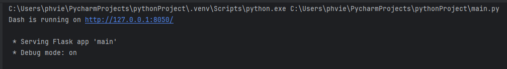
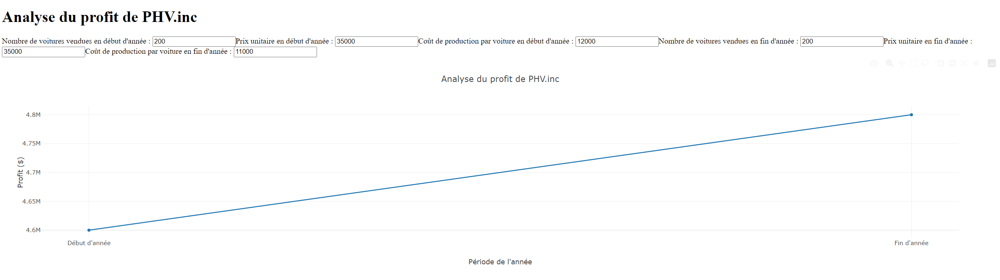

# Tutoriel: Qu'est-ce que Dash : pourquoi et comment l'utiliser ?

## Introduction et mise en contexte
Depuis un certain temps maintenant, les sites web ainsi que les applications web sont devenus des éléments primordiaux pour toute entreprise, pour des individus (lorsque cela s’applique), pour des organismes, et bien d'autres. Que ce soit pour afficher leurs produits, mettre en avant des informations, annoncer des nouveautés et bien d'autres choses, les sites web ainsi que les applications web peuvent être constitués d'innombrables éléments permettant aux individus de naviguer à travers ceux-ci et de combler leurs besoins. Bien que plusieurs applications permettent de créer des sites et applications web, que plusieurs vidéos sur le net permettent la création ainsi que le développement de ceux-ci et bien d'autres ressources soient disponibles, il existe une plateforme aidant toutes les personnes voulant concevoir une application ou un site web en utilisant le langage Python sans avoir besoin de connaissances approfondies en programmation. Dash est cette plateforme. 

## Connaissance Préalables 
Afin de suivre ce tutoriel, il est important d'avoir les connaissances générales de base en programmation en Python, sans nécessiter une expertise avancée, mais seulement une compréhension fondamentale. Voici quelques exemples :
- Syntaxe de base (variables, types de données, opérateurs, structures, etc.)
- Fonctions (définition et appel des fonctions)
- Dictionnaires
- Modules et bibliothèques (importation et utilisation de modules et de bibliothèques externes)
- Traitement des données (lecture, écriture de fichiers, manipulation des données et opérations de base sur les données)

Ne vous inquiétez pas si vous n'êtes pas très familier avec les bases du langage de programmation Python, car il est facile de trouver des informations générales sur son utilisation sur Internet ou en posant des questions à ChatGPT. De plus, lors de votre utilisation de l'application Dash, celle-ci vous guidera à travers les connaissances nécessaires.
Enfin, comme expliqué ci-dessous, la plateforme Dash est open source, ce qui signifie que vous pouvez poser vos questions à la communauté si vous ne trouvez pas de réponse à vos interrogations.

## Qu’est ce que Dash ?
Dash est une plateforme open-source conçue pour simplifier le développement d'applications web interactives avec le langage Python. Une plateforme open-source signifie qu'elle est accessible au public, et que n'importe quel individu peut consulter, modifier et distribuer le code selon ses besoins. C'est une approche très bénéfique pour l'apprentissage et la collaboration au sein de la communauté. Dash offre aux utilisateurs la possibilité de créer une multitude d'éléments pour des applications ou des sites web, tels que des tableaux de bord dynamiques ou des visualisations de données. Cette plateforme est conçue dans le but d'être utilisée sans nécessiter de connaissances approfondies dans un langage de programmation quelconque.

## Pourquoi utiliser Dash ?
La plateforme Dash offre plusieurs avantages, notamment : 

-   #### Sa facilité d'utilisation :
    Dash permet à ses utilisateurs de créer des applications web interactives en utilisant uniquement un langage de programmation, à savoir Python. Bien que cet avantage puisse sembler anodin, lorsqu'on examine les différentes méthodes de conception des applications web, on remarque que beaucoup d'entre elles font appel à des langages de programmation tels que HTML, CSS et JavaScript. Bien que ces langages soient essentiels à la création d'applications web, ils exigent une courbe d'apprentissage bien plus élevée que le langage de programmation Python. C'est pourquoi Dash permet aux développeurs et aux individus de créer des applications web sans avoir à maîtriser ces langages de programmation plus "traditionnels".

-	#### Son intégration avec la bibliothèque Plotly : 
     Dash est basé sur Plotly, une bibliothèque de visualisation de données en Python. En bref, Plotly offre à ses utilisateurs une grande variété de formats de graphiques et de fonctionnalités de visualisation de données. Que ce soit par exemple des graphiques linéaires, des graphiques circulaires, des nuages de points, des diagrammes en boîte et bien d'autres, de nombreux formats sont disponibles pour permettre aux utilisateurs de créer, explorer et manipuler les données en vue d'une analyse approfondie, pour finalement les intégrer à leur application web Dash.

-	#### Sa flexibilité et sa personnalisation : 
     Bien que Dash simplifie le processus de développement de sites web et d'applications web, tel est son objectif principal, il offre également à ses utilisateurs une grande flexibilité et des possibilités de personnalisation avancées. Ainsi, il est possible avec Dash de personnaliser l'apparence des tableaux de bord et d'y intégrer des fonctionnalités avancées en fonction des besoins spécifiques des utilisateurs. En fin de compte, il existe une multitude de possibilités que les utilisateurs peuvent exploiter en fonction de leurs propres besoins. 

-	#### Son déploiement facile : 
     Une fois que l'application Dash est créée et installée (voir les instructions ci-dessous), il est facile de la déployer sur plusieurs plateformes, telles que les serveurs locaux ainsi que les services cloud.

## Comment utiliser Dash ?

#### 1. Installation de Dash sur votre système:
```python
pip install dash
```
(Avant d'écrire le code, exécutez cette commande dans le terminal pour installer Dash correctement)

#### 2. Importez les composantes nécessaires dans votre script Python. Le module `dash` est généralement utilisé pour les composantes de base de Dash, tandis que les éléments d'interface utilisateur utilisent les modules `dash_core_components` et `dash_html_components`. Voici un exemple de ce qui peut être fait :
```python
import dash
from dash import dcc, html
```

#### 3. Ensuite, nous pouvons passer à la création de l'application en créant une instance de la classe `dash`. Cela va créer une application web Dash vide dans laquelle vous pouvez ajouter des composantes par la suite. Voici un exemple de ce qui peut être fait :
```python
app = dash.Dash(__name__)
```

#### 4. Ensuite, nous pouvons passer à la mise en place de la mise en page. Pour cela, nous pouvons utiliser les composantes de Dash telles que stipulé à l'étape 2 pour définir la mise en place de l'application. L'utilisation de la composante `dash_html_components` peut être utilisée pour définir la structure HTML de l'application (toujours en utilisant seulement le langage de programmation Python) et la composante `dash_core_components` peut être utilisée pour ajouter des éléments interactifs tels que les graphiques, les tableaux, etc. Voici un exemple de ce qui peut être fait :
```python    
app.layout = html.Div([
html.H1("Mon Application Dash"),
# Autres composants ici...
])
```

#### 5. Une fois que la mise en page de base est définie, vous pouvez définir les interactions entre les différentes composantes de l'application. Par exemple, vous pouvez définir une fonction de rappel (callback) qui spécifie comment les graphiques doivent réagir aux sélections de l'utilisateur. Lorsqu'on utilise la fonction de rappel avec Dash, cela spécifie notamment les entrées (input) et les sorties (output) de la fonction et nous sommes donc en mesure de pouvoir changer les données comme bon nous semble et les graphiques et tableaux s'adapteront en conséquence. Voici un exemple de ce qui peut être fait :
```python    
@app.callback(
    Output('my-graph', 'figure'),
    [Input('my-dropdown', 'value')]
)
def update_graph(selected_value):
    # Code pour mettre à jour le graphique en fonction de la valeur sélectionnée
    return updated_figure
```

#### 6. Finalement, nous pouvons exécuter l'application. Pour cela, il vous suffit d'utiliser la méthode `run` de l'instance Dash que vous avez créée. Cela va démarrer un serveur local et l'application sera accessible via un navigateur web. Voici un exemple de ce qui peut être fait :
```python 
if __name__ == '__main__':
    app.run_server(debug=True)
```

#### 7. Pour vous assurer que tout fonctionne correctement, vous pouvez naviguer à travers l'application sur un navigateur web que l'étape 6 vous a fourni. Lors de votre navigation, vous pourrez remarquer les différents graphiques, tableaux et liens entre ceux-ci que vous avez indiqués dans votre code. Bien sûr, au début et lors des premières utilisations, il peut être normal que certaines choses ne fonctionnent pas comme vous le désirez, alors vous devrez retourner voir les étapes 2 à 6 et effectuer les modifications nécessaires.

#### Note Générale:
En résumé, en suivant les étapes 1 à 6, vous serez en mesure de créer rapidement des applications web ainsi que des sites web interactifs en utilisant uniquement le langage de programmation Python à l'aide de Dash. Une fois la base créée, vous pourrez continuer à développer et à améliorer l'application en ajoutant des fonctionnalités supplémentaires, des composantes interactives et bien plus encore selon vos besoins spécifiques.

Il est important de noter que les étapes 2 à 6 ne sont que des exemples, et de nombreuses autres possibilités s'offrent à vous lorsque vous utilisez Dash pour créer des sites web et des applications web. Cependant, ces étapes illustrent une possibilité de ce qui peut être fait de base en utilisant Dash.

## Mis en application en milieu d’analyse de données d’affaires
Il est difficile de fournir un exemple concret d'application pour l'analyse de données en milieu d'affaires, car cela impliquerait de créer une application web. Cependant, on peut envisager l'utilisation de Dash lorsque, par exemple, une entreprise souhaite partager sur une application web des analyses de ses ventes pour montrer aux investisseurs et aux consommateurs comment elle se porte financièrement. Ces analyses pourraient être présentées sous forme de tableaux et de graphiques réalisés à l'aide de Dash. De même, Dash pourrait être utilisé par des professionnels travaillant sur les marchés financiers pour présenter sur un site web leurs analyses d'actions et leur évolution dans le temps (présentées sous forme de tableaux, de graphiques ou d'autres possibilités innombrables offertes par Dash). En résumé, Dash offre une multitude de possibilités à ses utilisateurs pour leur permettre de partager des analyses de données à partir de sites ou d'applications web, et ce de manière simple en utilisant uniquement le langage de programmation Python.

Par conséquent, j'ai quand même décidé de passer par les étapes 1 à 6 mentionnées précédemment pour vous montrer une mise en application de base.

Pour les besoins de cet exemple, nous utiliserons une entreprise fictive nommée PHV.inc qui vend des voitures en début d’année au prix unitaire de 35 000 $, avec un coût de production de 12 000 $, et ayant vendu une quantité de 200 voitures. Pour des fins d’analyse, nous aurons aussi des données en fin d’année avec toujours 200 voitures vendues et un prix unitaire de 35 000$, mais maintenant avec un coût de production de 11 000$. (Bien entendu, tout ceci est un exemple fictif avec peu de données, mais cela peut vous donner une idée de ce à quoi pourrait ressembler un code simple réalisé avec la plateforme Dash.)

### 1. 
```python
pip install dash
```

### 2. 
```python
import dash
from dash import dcc, html
from dash.dependencies import Input, Output
import plotly.graph_objs as go
```

### 3.
```python
app = dash.Dash(__name__)
```

### 4. 
```python
app.layout = html.Div([
    html.H1("Analyse du profit de PHV.inc"),
    html.Label("Nombre de voitures vendues en début d'année : "),
    dcc.Input(id='start-cars-sold', type='number', value=200),
    html.Label("Prix unitaire en début d'année : "),
    dcc.Input(id='start-unit-price', type='number', value=35000),
    html.Label("Coût de production par voiture en début d'année : "),
    dcc.Input(id='start-production-cost', type='number', value=12000),
    html.Label("Nombre de voitures vendues en fin d'année : "),
    dcc.Input(id='end-cars-sold', type='number', value=200),
    html.Label("Prix unitaire en fin d'année : "),
    dcc.Input(id='end-unit-price', type='number', value=35000),
    html.Label("Coût de production par voiture en fin d'année : "),
    dcc.Input(id='end-production-cost', type='number', value=11000),
    dcc.Graph(id='profit-graph')
])
```

## 5. 
```python
@app.callback(
    Output('profit-graph', 'figure'),
    [Input('start-cars-sold', 'value'),
     Input('start-unit-price', 'value'),
     Input('start-production-cost', 'value'),
     Input('end-cars-sold', 'value'),
     Input('end-unit-price', 'value'),
     Input('end-production-cost', 'value')]
)
def update_profit_graph(start_cars_sold, start_unit_price, start_production_cost,end_cars_sold, end_unit_price, end_production_cost):
    start_profit = (start_cars_sold * start_unit_price) - (start_cars_sold * start_production_cost)
    end_profit = (end_cars_sold * end_unit_price) - (end_cars_sold * end_production_cost)
    
    data = [
        go.Scatter(x=['Début d\'année', 'Fin d\'année'], y=[start_profit, end_profit], mode='lines+markers', name='Profit')
    ]
    layout = go.Layout(
        title='Analyse du profit de PHV.inc',
        xaxis=dict(title='Période de l\'année'),
        yaxis=dict(title='Profit ($)')
    )
    return {'data': data, 'layout': layout}
```

## 6.
```python
if __name__ == '__main__':
    app.run_server(debug=True)
```
Ainsi, en suivant les étapes de l'exemple, nous serons en mesure de créer une application Dash qui nous permet d'entrer le nombre de voitures vendues, le prix unitaire ainsi que le coût de production par voiture en début et en fin d’année, puis d'afficher le total des profits de l'entreprise PHV.inc en fonction de ces données dans un graphique linéaire. Ces données pourront être modifiées à tout moment, nous permettant par exemple de calculer notre marge de profit en ajustant le coût de la voiture et bien d'autres possibilités.

De plus, lorsque nous exécuterons l'étape 6, un serveur local sera lancé, à partir duquel nous pourrons ouvrir l'application web et visualiser les résultats de notre code.

Voici l'endroit ou vous pouvez voir le lien de l'application web lorsque vous runner le code:


Voici le résulat de l'exemple:



## Résumé
En résumé, la prochaine fois que vous aurez besoin de créer des sites web ou des applications web pour présenter des données ou autres, vous pourrez désormais utiliser l'application Dash. Cette plateforme, qui fonctionne uniquement avec le langage de programmation Python, vous permettra de manière simple et efficace de créer des graphiques et des tableaux pour réaliser des analyses de données. Ce tutoriel aura démontré la facilité d'utilisation de la plateforme Dash ainsi que les premiers pas à effectuer pour l'utiliser. De plus, étant donné que Dash est une plateforme open source, il est facile de poser vos questions à la communauté en cas de problèmes. Bien que ce tutoriel ne présente que les bases, Dash offre une multitude de possibilités plus approfondies. À vous de jouer maintenant !

### Bibliographie
https://dash.plotly.com/tutorial

https://www.statcan.gc.ca/fr/science-donnees/reseau/interface-utilisateur-plotly-dash

https://dash.plotly.com/

http://web.univ-ubs.fr/lmba/lardjane/optim/Python-Dash.pdf

ChatGPT
