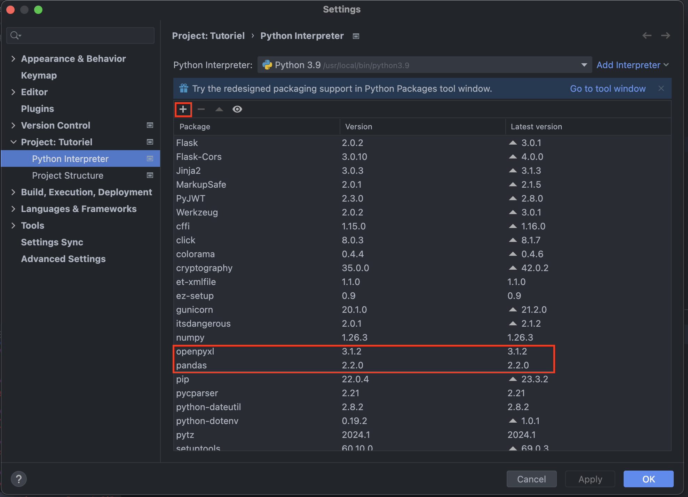
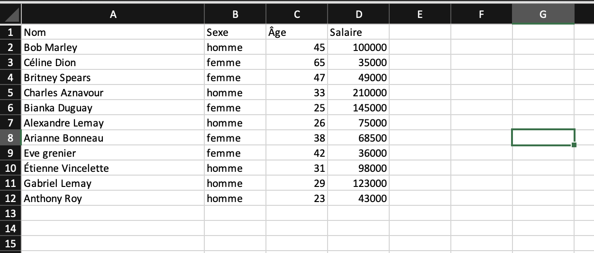
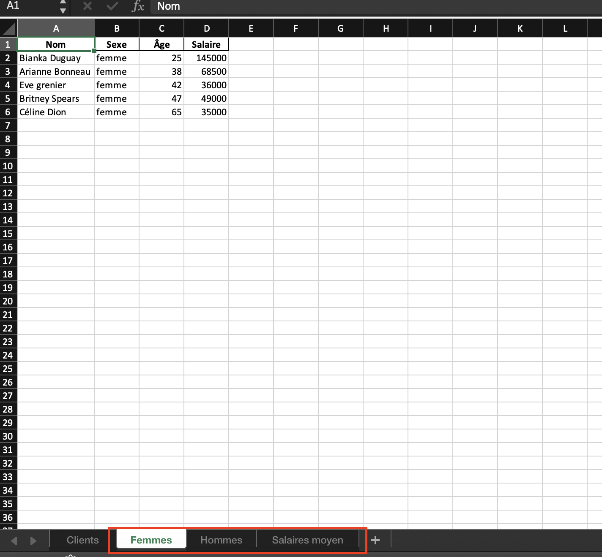

# Comment manipuler les données d’un fichier Excel avec Python

Que ce soit pour le travail, l’école, ou encore pour un projet personnel, savoir comment manipuler les données d’un fichier Excel est un atout qui vous fera économiser du temps! Si vous voulez trier une liste, calculer une moyenne, ou encore filtrer un nombre considérable de données, cet outil est votre meilleur ami. 

Nous avons un fichier Excel contenant une liste de clients ainsi que leurs informations personnelles. Nous voulons séparer la liste en 2, par sexe, classer les individus par ordre croissant d’âge, et calculer le salaire annuel moyen par sexe. Faire cette manipulation manuellement dans le fichier Excel nous prendrait beaucoup de temps, c’est pour cela que nous allons utiliser un script Python.

## Format Excel

Le format Excel représente un type d’extension de fichier que l’on nomme fichier Excel. Celui-ci est principalement utiliser pour manipuler des données, comme par exemple, pour de la comptabilité. 

Pourquoi utiliser Excel :
-	Facilite la visualisation de données
-	Permet de structurer des données à l’aide de tableaux
-	Permet la création de graphiques à partir de données
-	Permet d’automatiser des calculs à l’aide de formules
-	Peu coûteux 
-	Permet de lier des données entre plusieurs fichiers

Le format Excel est une bonne alternative, beaucoup moins coûteuse, à un logiciel de gestion.

## Python

Python est un langage de programmation compatible avec plusieurs plateformes, utilisé autant pour le développement web que pour le Machine Learning. Dans ce tutoriel, nous nous pencherons sur l’automatisation de tâche grâce aux scripts Python. Les scripts permettent d’automatiser des tâches normalement effectuées par des humains telles que :
-	Renommer plusieurs fichiers d’un coup
-	Retirer les mots inscrits en double dans un fichier
-	Faire des calculs mathématiques
-	Trouver le mot le plus répété dans une liste
-	Trier des données dans l’ordre souhaité
  
Il existe ce qu’on appelle des bibliothèques, que nous pouvons utiliser avec Python, qui sont en réalité une collection de code déjà écrit que tous peuvent réutiliser. C’est avec une bibliothèque Python que nous parviendrons à écrire un script qui automatisera la manipulation des données de notre fichier Excel.

### Bibliothèques

Comme mentionné plus haut, une bibliothèque est une collection de code polyvalent et réutilisable, disponible pour tous les programmeurs. Leur utilisation permet d’éviter d’écrire un code de A à Z, et donc de simplifier l’écriture ainsi que la lecture de celui-ci. Utiliser une bibliothèque peut aussi être avantageux pour avoir un code de qualité, sans avertissements et sans erreurs.

Pour être en mesure d’aller chercher les données de notre fichier Excel, nous aurons besoin de 2 bibliothèques; pandas et openpyxl.

#### Pandas 

La bibliothèque python pandas est utilisée pour lire, analyser et manipuler des données en python. C’est un outil puissant qui repose sur des tableaux de données de 2 dimensions, et les données peuvent être autant des nombres que des caractères. Pandas permet de restructurer des tableaux de données, par exemple, en modifiant les colonnes, ordonner des données, faire des calculs, en bref, c’est de la science de données.

#### Openpyxl

La bibliothèque python openpyxl est utilisée pour lire et écrire des données dans un fichier Excel. Elle est souvent utilisée avec la bibliothèque pandas, puisqu’elles ont des fonctionnalités complémentaires. Openpyxl vous permet entre autres de renommer, ajouter, ou supprimer une feuille Excel, formatter des cellules, ou encore ajouter des images.

## Installation

Avant d’être en mesure de lire et de manipuler les données de notre fichier Excel, nous devons installer les bibliothèques mentionnées plus haut. 
Pour ce faire, nous allons ouvrir PyCharm, ou tout autre environnement de développement intégré (IDE), et naviguer vers les réglages comme suit : **File \> Settings \> Chercher « Python Interpreter »**.
Lorsque vous êtes dans cet onglet, vous pouvez simplement ajouter un « package » en appuyant sur le plus **(+)** et en inscrivant le nom désiré. Dans notre cas, nous voulons installer « **pandas** » et « **openpyxl** ». Lorsque c’est fait, vous devriez les voir apparaitre dans votre liste de « packages » **(voir encadrés rouges dans l’image)**.

Vous pouvez maintenant appuyer sur « OK » et créer votre projet!

## Lecture des données

Ensuite, nous voulons accéder aux données des clients qui se retrouvent dans le fichier Excel depuis le script python. Voici un apperçu du fichier Excel qui se retrouve également dans les fichiers plus haut : 

Une fois que le projet est créé et qu’il contient un fichier « **.py** », la première étape est d’importer la bibliothèque pandas. Après, nous allons lire le fichier Excel en spécifiant le bon chemin d’accès en paramètre dans la fonction « read_excel() ». On conserve le résultat dans une variable qui sera de type tableau. Et, bien sûr, nous allons afficher les données pour confirmer que la manipulation a bien fonctionnée.

**Exemple :**

        import pandas as pd
        #Lire les données du fichier Excel
        listeClientsExcel = pd.read_excel("../clients.xlsx")
        #Afficher les données
        print(f"Données contenues dans le fichier Excel : \n {listeClientsExcel}\n")

**Résultat attendu lorsqu’on roule le script :** 

        Données contenues dans le fichier Excel : 
                            Nom   Sexe  Âge  Salaire
        0           Bob Marley  homme   45   100000
        1          Céline Dion  femme   65    35000
        2       Britney Spears  femme   47    49000
        3     Charles Aznavour  homme   33   210000
        4        Bianka Duguay  femme   25   145000
        5      Alexandre Lemay  homme   26    75000
        6      Arianne Bonneau  femme   38    68500
        7          Eve grenier  femme   42    36000
        8   Étienne Vincelette  homme   31    98000
        9        Gabriel Lemay  homme   29   123000
        10         Anthony Roy  homme   23    43000`

On peut observer que ce sont bel et bien les données du fichier, ce qui nous apporte à la prochaine étape.

## Manipulation des données

Une fois que nous avons accès aux données, nous voulons les restructurer. Il y a plusieurs fonctionnalités disponibles pour la manipulation des données. Dans notre cas, nous voulons séparer les clients en 2 listes par sexe, les ordonner en ordre croissant d’âge, et calculer le salaire annuel moyen pour chaque sexe.

Pour ce faire, nous allons prendre le tableau de données de l’étape précédente et créer 2 variables de type tableau à partir de celle-ci. Pour les femmes, nous allons retrouver les données pour lesquels la colonne nommée « sexe » contient la valeur « **femme** », et même principe pour les hommes, avec la valeur « **homme** ». Nous pouvons également directement ordonner les données avec la fonction « sort_values() », qui prend en paramètre la colonne de données à partir de laquelle on veut trier les clients.

**Exemple :**

      #Créer une liste de femmes uniquement, ordonnée par leur âges
      listeFemmesordonnée = listeClientsExcel[listeClientsExcel['Sexe'] == "femme"].sort_values("Âge")
      #Afficher la liste de femmes ordonnée
      print(f"Liste des femmes ordonnée par leur âge : \n{listeFemmesordonnée}\n")

      #Créer une liste d'homme uniquement, ordonnée par leur âges
      listeHommesordonnée = listeClientsExcel[listeClientsExcel['Sexe'] == "homme"].sort_values("Âge")
      #Afficher la liste d'homme ordonnée
      print(f"Liste des hommes ordonnée par leur âge : \n {listeHommesordonnée}\n")

**Résultat :** 

      Liste des femmes ordonnée par leur âge : 
                     Nom   Sexe  Âge  Salaire
      4    Bianka Duguay  femme   25   145000
      6  Arianne Bonneau  femme   38    68500
      7      Eve grenier  femme   42    36000
      2   Britney Spears  femme   47    49000
      1      Céline Dion  femme   65    35000

      Liste des hommes ordonnée par leur âge : 
                          Nom   Sexe  Âge  Salaire
      10         Anthony Roy  homme   23    43000
      5      Alexandre Lemay  homme   26    75000
      9        Gabriel Lemay  homme   29   123000
      8   Étienne Vincelette  homme   31    98000
      3     Charles Aznavour  homme   33   210000
      0           Bob Marley  homme   45   100000

Pour la calculer la moyenne des salaires, il suffit d’utiliser la fonction « mean() ». Nous pouvons également arrondir les chiffres à l’aide de « round() », qui prend en paramètre le chiffre, et le nombre de chiffres attendu après la virgule. Puisque la moyenne des salaires ne provient pas du fichier, ce n’est pas un tableau. Nous allons donc créer une variable de type tableau pour être en mesure d’écrire plus facilement les résultats dans une feuille de calcul du fichier Excel.

**Exemple :**

      #créer un objet avec les salaires moyen
      data = {
          "Sexe": ["Femme", "Homme"],
          "Salaire moyen": [round(listeFemmesordonnée["Salaire"].mean(), 2), round(listeHommesordonnée["Salaire"].mean(), 2)]
      }
      #Transformer l'objet  de salaires moyen en tableau
      salairesMoyen = pd.DataFrame(data)
      #Afficher le tableau des salaires moyen
      print(f"Tableau des salaires moyen : \n {salairesMoyen}")

**Résultat :**

      Tableau des salaires moyen : 
           Sexe  Salaire moyen
      0  Femme       66700.00
      1  Homme      108166.67

## Écriture des résultats

Maintenant que les données sont restructurées, nous voulons les remettre dans le fichier Excel, dans des feuilles de calcul. Avec pandas et openyxl cette manipulation est très simple.

À noter que si les feuilles de calculs existent déjà, vous obtiendrez une erreur. Il faut donc soit changer leur nom avant de rouler le script, soit les supprimer.

**Exemple :**

      #Écrire les résultats dans de nouvelles feuilles de calculs
      with pd.ExcelWriter('../clients.xlsx', engine='openpyxl', mode='a') as writer:
          listeFemmesordonnée.to_excel(writer, sheet_name='Femmes', index=False)
          listeHommesordonnée.to_excel(writer, sheet_name='Hommes', index=False)
          salairesMoyen.to_excel(writer, sheet_name='Salaires moyen', index=False)
    
**Résultat :**

## Conclusion

Python est un outil très utile pour l’optimisation des tâches, surtout lorsque ce sont des tâches que vous devez effectuer fréquemment. Dans ce tutoriel, nous avons vu seulement un aperçu de ce que python et ses bibliothèques ont à offrir. N’hésitez pas à aller voir la documentation pour vos futurs projets!
