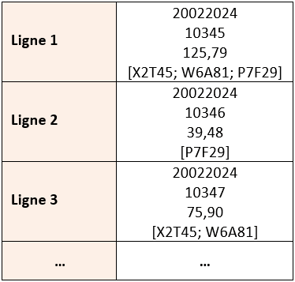
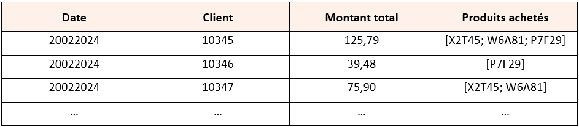

# Table des matières

- [Qu'est-ce que le format Parquet : pourquoi et comment l'utiliser ?](#quest-ce-que-le-format-parquet-pourquoi-et-comment-lutiliser)
- [Qu’est-ce que le format parquet?](#quest-ce-que-le-format-parquet)
- [Pourquoi utiliser le Parquet au lieu d’un autre format?](#pourquoi-utiliser-le-parquet-au-lieu-dun-autre-format)
- [Exemple (Parquet – Colonne | CSV – Ligne)](#exemple-parquet-colonne-csv-ligne)
- [Problématique – Mise en contexte](#problématique-mise-en-contexte)
- [Conclusion](#conclusion)
- [Annexe](#annexe)
- [Comment utiliser le format parquet de A à Z : De l’installation à
l’utilisation](#comment-utiliser-le-format-parquet-de-a-à-z-de-linstallation-à-lutilisation)
- [Code Python](#code-python)
- [Bibliographie](#bibliographie)

# Qu'est-ce que le format Parquet : pourquoi et comment l'utiliser ?

Ce tutoriel vous permettra d’en connaitre davantage sur le traitement de
données d’affaires dans le format de fichier Apache parquet, plus connu
sous le nom du format parquet. De plus, ce document couvrira les cas de
lecture et de manipulation de données de ce fichier.

## Qu’est-ce que le format parquet?

Le format parquet a été développé par Apache Software afin de répondre à
des enjeux précis rencontrés lors d’analyses complexes. Ce format est
souvent utilisé pour stocker et traiter des quantités massives de
données et donc, il est fréquemment utilisé pour les analyses dans les
domaines tels que le « Big data[1] » et l’analytique. Dans un fichier au
format parquet, les données sont organisées en colonnes, ce qui permet
une performance optimale du traitement de données.

Ce format peut être traité avec différents outils (*Framework, moteur de
requête, logiciels…*) tels qu’Apache Hadoop, Apache Spark, Apache Hive,
Databricks et plusieurs autres. L’intégration de ces divers outils rend
le traitement distribué des données beaucoup plus simple et efficace, ce
qui permet au domaine, tel le « Big Data », d’obtenir une solution
répondant à leur besoin. Le format parquet peut également être utilisé
avec des langages de programmation tels Python, C++, Java, etc. Du fait
que le code source est public, autrement dit « open source », il est
possible de travailler librement dans ce type de fichier. De plus, il
favorise l’interopérabilité entre les bibliothèques, telles que pyarrow
et pandas, ce qui permet de lire et de manipuler efficacement les
données d’une bibliothèque à une autre.

### Pourquoi utiliser le Parquet au lieu d’un autre format?

Il y a plusieurs avantages à utiliser le format Apache Parquet plutôt
qu’un autre. Tout d’abord, il permet une meilleure compression des
données, un stockage colonnaire, ce qui mène à une performance optimale
du traitement de données, ainsi qu’à une adaptation des modifications
dans la structure de données à travers le temps.

Comme démontré à la section « *Comment utiliser le format parquet de A à
Z : De l’installation à l’utilisation* », l’utilisation du format
parquet permet non seulement de réduire la taille des fichiers mais
aussi d’accélérer le temps de traitement des données.  
Étant donné que le format parquet est un stockage en colonnes, il est
plus simple pour le langage de programmation Python de faire la lecture
des données, car il lit seulement les colonnes nécessaires à la requête,
ce qui réduit énormément la quantité de données à traiter. Contrairement
au stockage en colonnes, le stockage en ligne, tel que vu dans le format
CSV, lit l’entièreté des données de chaque ligne, ce qui alourdit
considérablement le traitement des données. Il est donc bien important
de choisir le format selon nos besoins d’analyse afin d’assurer une
performance optimale de la requête et ainsi d’avoir un gain de temps
considérable.

Bref, les données stockées en colonnes se lisent plus rapidement que
celles stockées en ligne étant donné que Python peut seulement lire les
colonnes nécessaires à la demande et non toutes les colonnes d’une ligne
comme vue dans le stockage en ligne. L’orientation du stockage aura
aussi un impact sur la vitesse de lecture des données ainsi que la
taille des fichiers traités.

### Exemple (Parquet – Colonne | CSV – Ligne)

Voici à quoi ressemble un fichier au format parquet contenant des
informations fictives sur les transactions d’un magasin de détail :
(*Exemple simplifié – Orientation colonne vs ligne*)




**Stockage en ligne**



**Stockage en colonne**

Dans ces exemples, le tableau de stockage en ligne, tel le format CSV,
permet de voir que chaque ligne contient les informations de la
transaction de chaque client. Alors que dans le stockage en colonnes,
comme parquet, on voit que chaque colonne représente un sujet différent
de la transaction (*Date, Client, Montant total, Produits achetés*).
Bien que les deux représentent des données identiques, la lecture du
fichier n’est pas la même. Avec ces tableaux, il est plus simple de
comprendre comment le stockage colonnaire permet de retrouver et traiter
plus facilement et rapidement les données.

Le format parquet est souvent privilégié lorsque les volumes de données
à traiter sont élevés. Un avantage primordial à utiliser ce format est
la possibilité de seulement interagir avec les colonnes voulues. Ce
format est fréquemment utilisé lorsqu’il est question d’analyses
complexes comprenant beaucoup trop d’informations non pertinentes à la
requête. Voici un exemple plus concret : un magasin de détail qui
cherche à analyser certaines informations relatives aux transactions,
telles que les produits achetés; les montants déboursés ainsi que
plusieurs autres.

Un des avantages importants que l’utilisation de parquet apporte dans
les entreprises est le gain de temps des requêtes, ce qui mène à un gain
monétaire. Bref, en utilisant les formats adéquats selon la demande, il
y a une économie de temps et de l’argent. C’est donc pourquoi il est si
important de bien choisir les formats de fichier, lors de
programmations, surtout dans un contexte d’affaire où l’on se doit
d’être le plus efficient possible.

### Problématique – Mise en contexte 

Une de vos amies possède un magasin de vêtements très populaires. Elle
aimerait faire des analyses sur les produits les plus achetés ainsi que
les ventes du magasin par jour, ces informations aideront grandement
l’entreprise pour sa croissance. Elle fait appel à vos connaissances en
codage afin d’obtenir toutes les informations nécessaires. Cependant,
elle vous met en garde que le magasin a un volume élevé de transactions,
ce qui pourrait être plus complexe et prendre plus de temps pour traiter
les données. Votre mission est de créer un script en Python en utilisant
le format Apache parquet afin d’assurer une meilleure efficacité de
performance et de répondre à sa demande d’analyse concernant les ventes
par produits et les ventes totales par jour.

### Conclusion 

La lecture de fichiers du format parquet en Python est une tâche
courante lors de la manipulation de données massives. La bibliothèque
« parquet » de Python facilite cette tâche en stockant et en partageant
efficacement les données de quantité massives, ce qui permet une
performance optimale du traitement de données. Il vous est maintenant
possible de lire et de manipuler des données du format parquet dans vos
projets Python. Les notions de ce tutoriel se limitent à un traitement
des données de transactions clients, mais il y a plusieurs autres
fonctionnalités au format Apache parquet. Selon Oracle, il sert entre
autres au développement de produits, à la sécurité contre la fraude et à
la prévention contre des défaillants mécaniques. Dans le cas où vous
voulez en connaitre davantage sur le sujet, veuillez consulter les liens
dans la bibliographie ou bien, effectuer vos recherches sur Internet
pour y trouver plusieurs informations supplémentaires et plus avancées.

# Annexe 

### Comment utiliser le format parquet de A à Z : De l’installation à l’utilisation

- **Étape 1 – Installation de Python et Pycharm**
  - Aller sur les liens et télécharger Python : https://www.python.org/downloads/
  -   Pycharm : https://www.jetbrains.com/pycharm/download/?section=windows
- **Étape 2 – Installation de pyarrow**
  -   Aller dans l’invite de commande de l’ordinateur, puis inscrire :
    **«** *pip install pyarrow* **»**.
- **Étape 3 – Installation de pandas**
  -   Aller dans l’invite de commande de l’ordinateur, puis inscrire :
    **«** *pip install pandas* **»**.
- **Étape 4 – Importation de la bibliothèque pyarrow dans Pycharm**
  -   Ouvrir un nouveau script dans Pycharm et inscrire : **«** *import
    pyarrow as pa* **»**.
- **Étape 5 – Importation de la bibliothèque pandas dans Pycharm**
  -   Dans le script, inscrire : **«** *import pandas as pd* **»**.
- **Étape 6 – Importation du format parquet dans la bibliothèque pyarrow**
  -   Dans le script, inscrire : **«** *import pyarrow.parquet as pq*
    **»**.
- **Étape 7 – Créer un fichier en format parquet à partir de données
fictives (*Exemple*)**
  -   *\# TODO : Créer un fichier en format parquet à partir de données
    fictives (Si nous n’avons pas déjà de fichier parquet)*
- **Étape 8 – Sélectionner les colonnes voulues pour l’analyse**
  -   *\# TODO : Extraire les colonnes voulues (heure, article, quantité
    et total)*
- **Étape 9 – Imprimer le montant total des ventes par article**
  -   *\# TODO : Effectuer une analyse simple - Montant total des ventes
    par article*
- **Étape 10 – Imprimer le montant total des ventes pour la date voulue**
  -   \# TODO : Calculer le montant total des ventes pour la date
    '2024-03-02'
- **Étape 13 (*Supplémentaire*) – Comparaison de la vitesse de lecture
d’un fichier parquet et CSV**
  - ***Afin de voir la différence entre le traitement de donné en ligne et
le traitement de donnée en colonnes***
  -   *\# TODO (Facultative) : Comparaison de la vitesse de lecture d'un
    fichier parquet et CSV*
- **Étape 14 (*Supplémentaire*) – Comparaison de la taille d’un même
fichier parquet et CSV**
  -   *\# TODO (Supplémentaires) : Comparaison de la taille d'un même
    fichier parquet et CSV*

### Code Python 

***PS : Si vous partez directement d’un fichier parquet, le code sera
différent.***

```python
# TODO : Créer un fichier en format parquet à partir de données fictives (Si nous avons pas déjà de fichier parquet)  

# Créer un DataFrame Pandas avec des transactions de vêtements  
import pandas as pd
import pyarrow as pa
import pyarrow.parquet as pq

# TODO : Créer un fichier en format parquet à partir de données fictives (Si nous avons pas déjà de fichier parquet)
# Créer un DataFrame Pandas avec des transactions de vêtements
clothing_transactions_df = pd.DataFrame([
    {"date": "2024-03-02", "heure": "10:30:15", "article": "Chemise en lin", "quantite": 4, "prix_unitaire": 39.99,
     "total": 159.96},
    {"date": "2024-03-02", "heure": "10:45:21", "article": "Jeans slim", "quantite": 3, "prix_unitaire": 59.99,
     "total": 179.97},
    {"date": "2024-03-02", "heure": "11:02:30", "article": "Robe d'été", "quantite": 3, "prix_unitaire": 49.99,
     "total": 149.97},
    {"date": "2024-03-02", "heure": "11:10:05", "article": "Robe de plage", "quantite": 3, "prix_unitaire": 59.99,
     "total": 179.97},
    {"date": "2024-03-02", "heure": "11:47:45", "article": "Manteau en laine", "quantite": 2, "prix_unitaire": 149.99,
     "total": 299.98},
    {"date": "2024-03-02", "heure": "12:55:30", "article": "Robe d'été", "quantite": 4, "prix_unitaire": 49.99,
     "total": 199.96},
    {"date": "2024-03-02", "heure": "13:00:42", "article": "Tee-shirt imprimé", "quantite": 5, "prix_unitaire": 24.99,
     "total": 124.95},
    {"date": "2024-03-02", "heure": "13:25:13", "article": "Pantalon en cuir", "quantite": 2, "prix_unitaire": 99.99,
     "total": 199.98},
    {"date": "2024-03-02", "heure": "13:57:30", "article": "Bottines en cuir", "quantite": 1, "prix_unitaire": 109.99,
     "total": 109.99},
    {"date": "2024-03-02", "heure": "14:20:15", "article": "Robe d'été", "quantite": 4, "prix_unitaire": 49.99,
     "total": 199.96},
    {"date": "2024-03-02", "heure": "14:30:15", "article": "Bottines en cuir", "quantite": 1, "prix_unitaire": 109.99,
     "total": 109.99},
    {"date": "2024-03-02", "heure": "15:32:22", "article": "Robe de soirée", "quantite": 3, "prix_unitaire": 69.99,
     "total": 209.97},
    {"date": "2024-03-02", "heure": "15:34:30", "article": "Robe de soirée", "quantite": 3, "prix_unitaire": 69.99,
     "total": 209.97},
    {"date": "2024-03-02", "heure": "15:50:45", "article": "Bottines en cuir", "quantite": 2, "prix_unitaire": 109.99,
     "total": 219.98},
    {"date": "2024-03-02", "heure": "15:53:05", "article": "Robe d'été", "quantite": 5, "prix_unitaire": 49.99,
     "total": 249.95},
    {"date": "2024-03-02", "heure": "16:03:30", "article": "Manteau en laine", "quantite": 2, "prix_unitaire": 149.99,
     "total": 299.98},
    {"date": "2024-03-02", "heure": "16:10:12", "article": "Tee-shirt imprimé", "quantite": 6, "prix_unitaire": 24.99,
     "total": 149.94},
    {"date": "2024-03-02", "heure": "16:22:21", "article": "Jeans déchirés", "quantite": 2, "prix_unitaire": 74.99,
     "total": 149.98},
    {"date": "2024-03-02", "heure": "16:40:05", "article": "Robe de plage", "quantite": 4, "prix_unitaire": 59.99,
     "total": 239.96},
    {"date": "2024-03-02", "heure": "16:54:30", "article": "Manteau en laine", "quantite": 1, "prix_unitaire": 149.99,
     "total": 149.99},
])

# Convertir le DataFrame en un tableau Arrow
clothing_table = pa.Table.from_pandas(clothing_transactions_df)

# Écrire le tableau Arrow dans un fichier Parquet
pq.write_table(clothing_table, 'clothing_transactions.parquet')

# TODO : Extraire les colonnes voulues (heure, article, quantité et total)
# Chemin vers le fichier Parquet
path_parquet = 'clothing_transactions.parquet'

# Lecture du fichier Parquet
table_parquet = pq.read_table(path_parquet)

# Convertir la table Parquet en DataFrame Pandas
df = table_parquet.to_pandas()

# Sélection des colonnes nécessaires (heure, article, quantité, total)
colonnes_selectionnees = ['heure', 'article', 'quantite', 'total']
df_selection = df[colonnes_selectionnees]

# Imprimer les lignes du DataFrame avec les colonnes voulues
print(df_selection)

# TODO : Effectuer une analyse simple - Montant total des ventes par article
# Effectuer l'analyse - Montant total des ventes par article
montant_total_ventes = df.groupby('article')['total'].sum()

# Imprimer les résultats de l'analyse
print("Montant total des ventes par article :\n", montant_total_ventes)

# TODO : Calculer le montant total des ventes pour la date '2024-03-02'
montant_total_ventes_journee = df[df['date'] == '2024-03-02']['total'].sum()

# Imprimer le montant total des ventes pour la journée '2024-03-02'
print("Montant total des ventes pour la journée '2024-03-02' est de : {:.2f}".format(montant_total_ventes_journee))

# TODO (Facultative) : Comparaison de la vitesse de lecture d'un fichier parquet et CSV
# Il est important de noter qu'il ne s'agit pas d'un fichier parquet contenant des données massives, donc il est évident que CSV sera plus rapide pour les lire.
```

```python
import timeit

# Chemin vers le fichier CSV fictif (pour la comparaison)
path_csv = 'clothing_transactions.csv'

# Sauvegarder le DataFrame Pandas au format CSV
clothing_transactions_df.to_csv(path_csv, index=False)

# Mesurer le temps de lecture du fichier CSV
temps_csv = timeit.timeit(lambda: pd.read_csv(path_csv), number=10)  # Lecture 10 fois pour avoir une mesure plus stable
print(f"Temps de lecture du fichier CSV : {temps_csv:.5f} secondes en moyenne")

# Mesurer le temps de lecture du fichier Parquet
temps_parquet = timeit.timeit(lambda: pq.read_table(path_parquet).to_pandas(), number=10)
print(f"Temps de lecture du fichier Parquet : {temps_parquet:.5f} secondes en moyenne")

# Comparaison des temps de lecture
if temps_csv < temps_parquet:
    print("Lecture du fichier CSV est plus rapide que celle de Parquet.")
else:
    print("Lecture du fichier Parquet est plus rapide que celle de CSV.")
```

```python
import sys

# TODO (Supplémentaires) : Comparaison de la taille d'un même fichier parquet et CSV
# Mesurer la taille du DataFrame à partir du fichier Parquet
df_parquet = pq.read_table(path_parquet).to_pandas()
taille_df_parquet = sys.getsizeof(df_parquet)

# Sauvegarder le DataFrame Pandas au format CSV
df.to_csv(path_csv, index=False)

# Mesurer la taille du DataFrame à partir du fichier CSV
df_csv = pd.read_csv(path_csv)
taille_df_csv = sys.getsizeof(df_csv)

# Imprimer les résultats de la comparaison
print("Taille du DataFrame depuis le fichier Parquet :", taille_df_parquet, "octets")
print("Taille du DataFrame depuis le fichier CSV :", taille_df_csv, "octets")

# Comparaison des tailles entre les fichiers Parquet et CSV
if taille_df_csv < taille_df_parquet:
    print("Le DataFrame du fichier CSV est plus petit que celui du fichier Parquet.")
else:
    print("Le DataFrame du fichier Parquet est plus petit que celui du fichier CSV.")

```

# Bibliographie 

1.  Chamberland-Tremblay, Daniel (2024). GTA431 - Manipulation des
    données pour l'analytique, notes du cours [GitHub], Université de
    Sherbrooke.

2.  Apache Parquet. (s. d.). « Apache Parquet ». *Apache Parquet* [Site
    Web]. (https://parquet.apache.org) (Consulté le 17 février 2024).

3.  Download Python. (s. d.). « Download the latest version for
    Windows » *Python.org* [Site Web](https://www.python.org/downloads) (Consulté le 17 février 2024).

4.  Download PyCharm. (2021, 2 juin). « PyCharm Professional »
    *JetBrains* [Site Web](https://www.jetbrains.com/pycharm/download/?section=windows)
    (Consulté le 17 février 2024).

5.  Levy, E. (2023, 20 avril). « What is the Parquet File Format ? ».
    *Upsolver* [Site Web](https://www.upsolver.com/blog/apache-parquet-why-use) (Consulté le
    17 février 2024).

6.  Mauvière, É. (2022, 29 décembre). « Parquet devrait remplacer le
    format CSV. » *Icem7* [Site Web](https://www.icem7.fr/cartographie/parquet-devrait-remplacer-le-format-csv)
    (Consulté le 17 février 2024).

7.  « Apache Parquet pour le stockage de données volumineuses ». (s. d.). *CETIC - Your connection to ICT research* [Site Web](https://www.cetic.be/Apache-Parquet-pour-le-stockage-de-donnees-volumineuses)
    (Consulté le 17 février 2024).

8.  NeuralNine. (2023, 10 novembre). « Speed Up Data Processing with
    Apache Parquet in Python » *YouTube* [Vidéo](https://www.youtube.com/watch?v=M-Hcf-YdBAA) (Consulté le 17
    février 2024).

9.  « Qu’est-ce que le Big Data ? » (s. d.). *Oracle* [Site Web](https://www.oracle.com/ca-fr/big-data/what-is-big-data) (Consulté
    le 17 février 2024).

10. Jumelle, M. (s. d.). « Apache Parquet : tout savoir sur ce format de
    données. » *Blent* [Site Web](https://blent.ai/blog/a/apache-parquet-tout-savoir) (Consulté le 17
    février 2024).

11. Keldenich, T. (2023, octobre 6). « 3 Manières d’Ouvrir un Fichier
    Parquet en Python – Facile ». *Inside Machine Learning* [Site
    Web](https://inside-machinelearning.com/ouvrir-un-fichier-parquet-python)
    (Consulté le 17 février 2024).

12. InfluxData. (s. d.). « Apache Parquet ». *Influxdata* [Site Web](https://www.influxdata.com/glossary/apache-parquet) (Consulté le
    17 février 2024).

13. Apache. (s. d.). « Parquet ». GitHub [Site Web](https://github.com/apache/parquet-format) (Consulté le 17 février
    2024).

14. « FAQ. » (s. d.). *Apache Arrow* [Site Web](https://arrow.apache.org/faq) (Consulté le 17 février 2024).

15. « Reading and Writing the Apache Parquet Format » (s. d.). *Apache
    Arrow* [Site Web](https://arrow.apache.org/docs/python/parquet.html) (Consulté le 17
    février 2024).

16. Prajapati, S. (2023, 13 juin). « The Perfect File Format Unveiled :
    Parquet vs. CSV. » *Linkedin* [Site Web](https://www.linkedin.com/pulse/perfect-file-format-unveiled-parquet-vs-csv-shailendra-prajapati#:~:text=Parquet%20files%20are%20smaller%20than,ideal%20for%20storing%20complex%20data)
    (Consulté le 17 février 2024).

17. « What is Apache Parquet ? » (s. d.). *Databricks* [Site Web](Consulté le 17 février 2024).

18. « Methods for writing Parquet files using Python ? » (s. d.). *Stack
    Overflow* [Site Web](https://stackoverflow.com/questions/32940416/methods-for-writing-parquet-files-using-python)
    (Consulté le 17 février 2024).

19. Learn Data with Mark. (2023, 6 janvier). « Exporting CSV files to
    Parquet with Pandas, Polars, and DuckDB » *YouTube* [Vidéo](https://www.youtube.com/watch?v=aexszHMKdy8) (Consulté le 17
    février 2024).

20. Learn Data with Mark. (2022, 14 octobre). « An introduction to
    Apache Parquet » *YouTube* [Vidéo](https://www.youtube.com/watch?v=KLFadWdomyI) (Consulté le 17
    février 2024).

21. Rob Mulla. (2022, 3 avril). « This INCREDIBLE trick will speed up
    your data processes. » *YouTube* [Vidéo](https://www.youtube.com/watch?v=u4rsA5ZiTls) (Consulté le 17
    février 2024).

22. Data Mozart. (2023, 13 novembre). « Parquet File Format - Explained
    to a 5 Year Old ! » *YouTube* [Vidéo](https://www.youtube.com/watch?v=5NA57Pfpdr4) (Consulté le 17
    février 2024).

23. xavki. (2023, 2 mai). « Apache Parquet, c’est quoi ? ? » *YouTube*
    [Vidéo](https://www.youtube.com/watch?v=RfnvBTMxNUA) (Consulté
    le 17 février 2024).

24. Priximmo. (s. d.). « Sommaire des tutoriels xavski ». *GitHub*
    [Site Web](https://github.com/priximmo/sommaire-xavki-devops-fr)
    (Consulté le 17 février 2024).

[1] Qu’est-ce que le « Big Data » : Selon Oracle, « le Big Data est
composé de jeux de données complexes, provenant essentiellement de
nouvelles sources. Ces ensembles de données sont si volumineux qu’un
logiciel de traitement de données traditionnel ne peut tout simplement
pas les gérer. Mais ces énormes volumes de données peuvent être utilisés
pour résoudre des problèmes que vous n’auriez jamais pu résoudre
auparavant. »
