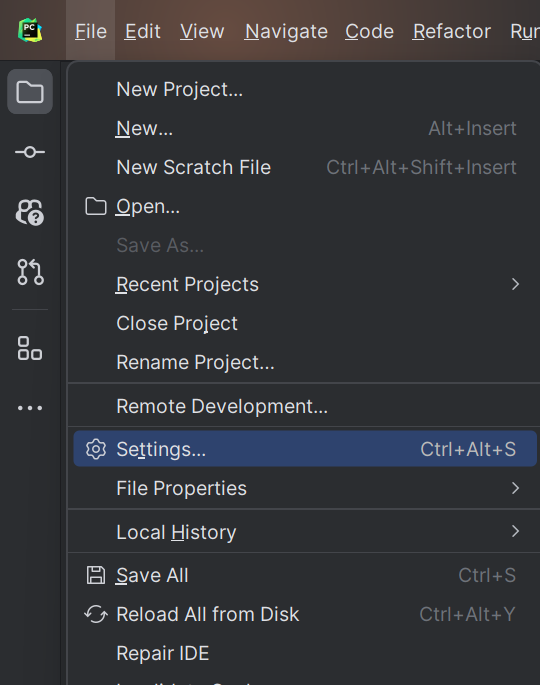
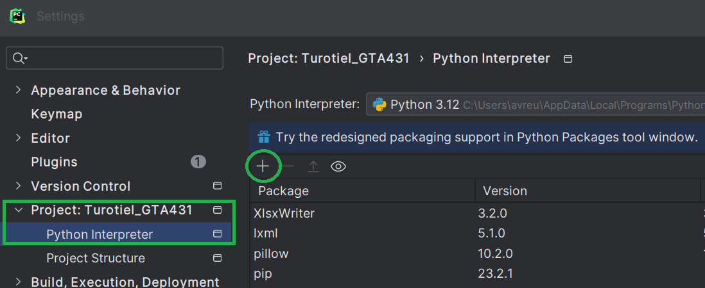
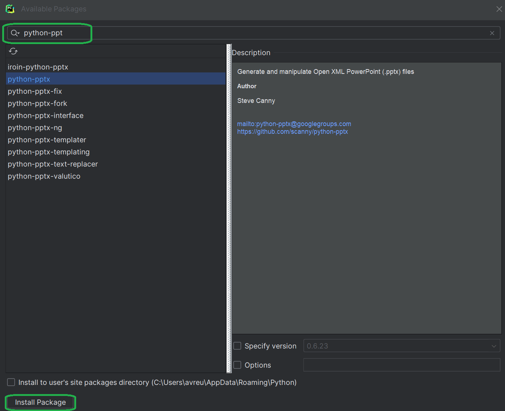
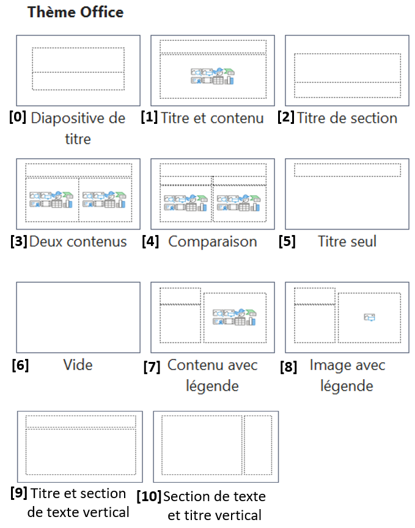

# Comment automatiser la production d'une présentation PPTX en Python?

## Contexte


En tant que scientifique des données, la capacité à réaliser des analyses complexes est indéniablement cruciale. Toutefois, tout aussi important est le talent de communiquer ces résultats. Une analyse approfondie perd de sa valeur si elle ne peut être transmise ou comprise par les parties prenantes. Les présentations PowerPoint se révèlent être l'outil couramment utilisé pour faciliter cette communication et le partage de connaissances. Néanmoins, la création manuelle de ces présentations peut s'avérer fastidieuse et chronophage. Dans ce tutoriel, nous plongerons dans l'automatisation de ce processus en exploitant le potentiel de la librairie python-pptx. Nous allons découvrir comment les éléments d'une présentation PowerPoint peuvent être manipulés comme objets à travers le code Python. Nous allons survoler certains éléments tout en approfondissant d'autres aspects spécifiques. Afin de suivre ce tutoriel, il est nécessaire d'avoir une connaissance de base en programmation Python (comprendre les boucles, les conditions, les fonctions, etc.), un environnement de développement intégré (IDE) fonctionnel, et évidemment, une connaissance de base de PowerPoint. 

## La thématique

La librairie python-pptx propose une solution puissante pour concevoir et personnaliser des présentations PowerPoint à partir de Python. Elle permet aux scientifiques des données de générer des documents visuels dynamiques et informatifs en automatisant la création de diapositives, l'ajout de texte, d'images, voire même de graphiques. Cela s'avère particulièrement utile pour simplifier les tâches fastidieuses et répétitives souvent associées à la création d'une présentation PowerPoint. Un exemple concret est la précision requise pour positionner méticuleusement des images aux emplacements appropriés sur plusieurs diapositives en utilisant les lignes de guides de PowerPoint. Un autre cas d'utilisation est la réalisation de présentations hebdomadaires où la structure reste inchangée, mais les données évoluent. Cette bibliothèque offre de nouvelles opportunités pour rendre la communication des résultats de la science des données plus rapide, efficace et reproductible.


## Tutoriel
### Installation de python-pptx

Tout d'abord, commençons par l'installation de python-pptx. L'installation peut se faire de plusieurs manières : en utilisant la ligne de commande de votre environnement, le terminal (CMD) de votre ordinateur, ou même l'interface utilisateur de votre environnement. Afin de simplifier le tutoriel et d'accommoder les lecteurs ayant moins d'expérience en informatique en général, nous détaillerons uniquement l'installation par l'utilisation de l'interface utilisateur. Pour des instructions détaillées sur les deux autres méthodes, de nombreuses ressources en ligne sont disponibles vous permettant de suivre les étapes nécessaires. Par exemple:

https://www.jetbrains.com/help/pycharm/installing-uninstalling-and-upgrading-packages.html. (L’installation de «pip» peut être un prérequis pour ces méthodes)

#### Installation de python-pptx par l’utilisation de l’interface utilisateur de l’environnement

  * Dirigiez-vous vers l’environnement de votre choix (dans le cas du cours, Pycharm est utilisé)
  
  * Sélectionner « Réglages » dans le menu « Fichiers » en haut à gauche <br/><br/>
  * 

    
  * Sélectionner votre projet et puis « Interpréteur de Python » <br/><br/>
  * 

  
  * Sélectionner le « + », entrez « python-pptx » dans la boite de recherche et installez <br/><br/>
  * 
    


Maintenant que python-pptx est installé vous pouvez commencer à créer des Power Point à partir de Python!


### Création et ouverture d’une présentation 

L'objectif de cette section est de créer une présentation vide pour y apporter des modifications ou d'ouvrir une présentation existante. Pour commencer, nous devons importer le module « presentation » de python-pptx. La propriété « Présentation() » de ce module crée une nouvelle présentation. Dans l'exemple suivant, cette présentation est stockée dans la variable « pres ». Elle est initialement vide et ne comporte aucune diapositive par défaut. Pour ouvrir une présentation existante, il suffit de spécifier le nom de celle-ci entre les parenthèses :

```
## demo1

## importation du module Presentation
from pptx import Presentation

# Création d'une nouvelle présentation
pres = Presentation()

# Sauvegarde de la présentation sous le nom demo1
pres.save('demo1.pptx')

# Ouverture d'une présentation existante
pres = Presentation('demo1.pptx')
```

Afin de sauvegarder toute manipulation, il est important de sauvegarder la présenation. Dans ce cas, la présentation est sauvegardée dans le dossier où se trouve le projet, mais il est important de ne pas oublier que nous pouvons spécifier son emplacement utilisant le chemin vers cet endroit. Ce tutoriel suppose que cette connaissance est déjà acquise en tant que base.

Maintenant qu'une présentation est créée, ouverte, et que nous sommes en mesure de la sauvegarder, nous pouvons procéder à sa modification.

### Diapositives  
Considérons une nouvelle présentation vierge, sans diapositive, par exemple, la présentation « pres » créée par la ligne 4 de l'exemple précédent. Avant d'ajouter une diapositive, il faut d'abord considérer la mise en page de celle-ci. Ceux qui sont familiers avec PowerPoint savent qu'il existe plusieurs types de mises en page, par exemple : un titre centré avec sous-titre, un entête avec une zone de texte, une diapositive vierge, etc. Dans la librairie python-pptx, il existe 11 mises en page différentes que l'on peut appeler en utilisant la propriété « slide_layouts ». Les mises en page sont numérotées de 0 à 10.



Une fois que la mise en page est choisie, la diapositive peut être ajoutée à la présentation en utilisant la propriété « add_slide ». L'exemple suivant démontre comment ajouter deux diapositives avec deux mises en page différentes à la présentation « pres ».
```
## demo2

PageTitre_layout = pres.slide_layouts[0]
PageTitre_slide = pres.slides.add_slide(PageTitre_layout)

PageContenu_layout = pres.slide_layouts[1]
PageContenu_slide = pres.slides.add_slide(PageContenu_layout)
```


Les indices 0 et 1 de la propriété « slide_layouts » indiquent le type de mise en page sélectionné. Les résultats sont stockés sous les variables se terminant par « layout ». Il est particulièrement utile d'utiliser des variables pour faire référence aux différents types de mises en page, surtout pour les présentations longues. La propriété « add_slide » prend le type de mise en page en argument pour finalement ajouter cette diapositive à la présentation.

Il est également possible de modifier la mise en page d'une diapositive existante.
```
    # demo3

    # Charger la présentation
    pres = Presentation('../demo2/demo2.pptx')

    # Récupérer la diapositive à modifier
    diapositive_a_modifier = pres.slides[0]

    # Obtenir la disposition (layout) originale de la diapositive
    layout_original = diapositive_a_modifier.slide_layout

    # Obtenir la disposition modifiée à assigner
    PageTitre_layout_modifie = pres.slide_layouts[2]

    # Assigner la disposition modifiée à la diapositive
    diapositive_a_modifier.layout = PageTitre_layout_modifie

    # Afficher les propriétés de la disposition originale et modifiée pour comparaison
    print("Disposition Originale :")
    print(layout_original.name)
    print("Disposition Modifiée :")
    print(PageTitre_layout_modifie.name)

    # Enregistrer la présentation modifiée
    pres.save('demo3.pptx')

```
Le code commence par charger la présentation spécifiée, puis récupère la première diapositive. Ensuite, il stocke la disposition originale de cette diapositive et sélectionne une nouvelle disposition à assigner. Après avoir effectué cette modification, le code affiche les noms de la disposition originale et de la nouvelle disposition pour validation du changement. Enfin, il enregistre la présentation modifiée sous un nouveau nom.

Bien que ce tutoriel se concentre sur l'exploration des fonctionnalités principales, il est essentiel de noter que cette bibliothèque offre également la possibilité de créer un masque de diapositive. Pour plus de détails, vous pouvez consulter la documentation liée à la fin du tutoriel.

### Éléments

À cette étape, nous sommes en mesure d'ajouter des éléments aux diapositives d'une présentation PowerPoint. Ces éléments peuvent inclure des formes (carrés, cercles, etc.), des graphiques, des tables, des images, du texte, etc. Ce tutoriel couvrira les grandes lignes et les éléments les plus importants, mais il est crucial de noter que cette bibliothèque offre bien plus de possibilités.

Il existe deux méthodes pour ajouter des éléments à une présentation PowerPoint. Prenons l'exemple de l'ajout de texte pour les comprendre. La première méthode consiste à créer une nouvelle zone de texte et la positionner sur la diapositive. La deuxième méthode, en revanche, consiste à ajouter du texte dans une zone de texte déjà existante et positionnée sur la diapositive, ou en d'autres termes, dans un espace réservé. 

La première approche offre une personnalisation étendue, mais la deuxième est beaucoup plus rapide et efficace, car de nombreux paramètres sont déjà prédéterminés. Reprenons l'exemple du texte pour illustrer ces deux stratégies. Si nous voulons ajouter un titre à une diapositive avec la première méthode, nous devons positionner une boîte de texte à l'endroit souhaité, spécifier la police, la taille du texte, en plus de préciser le texte lui-même. Avec la deuxième stratégie, nous devons simplement indiquer l'espace réservé que nous voulons cibler et le texte que nous voulons afficher. L'emplacement du texte, la police et la taille sont déjà déterminés par défaut par PowerPoint.

Il est possible de procédéer avec les 2 méthodes pour traiter les éléments mentionnés dans la section précédente. La stratégie pour accéder à l'espace réservé peut être généralisée pour tous les éléments, mais l'ajout et la personnalisation varient pour chacun. Ce tutoriel abordera donc d'abord comment accéder à un espace réservé, puis explorera comment ajouter et personnaliser certains éléments par la suite.

#### Espace réservé

Il existe différents type d'espcaces réservé, il faut donc s'assurer du type de l'espace avant d'y ajouter des éléments. 

Cet exemple nous permet de relever l'index et le nom du type d'espace d'une mise en page. 
(Considérons que les modules sont importés et qu'une nouvelle présentation est créée et qu'elle représentée par la variable pres.)

```
# demo 4

# Ajout d'une diapositive à une nouvelle présentation
Espace_reserve_layout = pres.slide_layouts[8]
Espace_reserve_slide = pres.slides.add_slide(Espace_reserve_layout)

# Trouver l'index et le nom des espaces réservés
for type in Espace_reserve_slide.placeholders:
     print('%d %s' % (type.placeholder_format.idx, type.name))


# Résultat
0  Title 1
1  Picture Placeholder 2
2  Text Placeholder 3

```
La deuxième colonne nous indique le type de l'espace réservé et la première son index. Avec l'index, on peut accéder à l'espace réservé et le nom de l'espace nous indique le type de donné qu'on peut y ajouter.   

Pour ajouter du contenu au titre, sous-titre et une image à cette diapositive: 

```
    # demo 5

    # Ajouter un titre
    titre_espace = Espace_reserve_slide.placeholders[0]
    titre = "Université de Sherbrooke"
    titre_espace.text = titre

    # Ajouter un sous-titre
    soustitre_espace = Espace_reserve_slide.placeholders[2]
    soustitre = "GTA431"
    soustitre_espace.text = soustitre

    # Ajouter une image
    image_espace = Espace_reserve_slide.placeholders[1]
    chemin_image = "data/Logo-UDS.png"
    image_espace.insert_picture(chemin_image)

    pres.save('image_added.pptx')

```
À noter que la logique pour ajouter une image est semblable à celle pour ajouter un graphique ou une table, il suffit d'utiliser la propriété « insert_chart » ou « insert_table » au lieu de « insert_picture » et s'assurer le lire le contenu des fichiers. Au cas ou que la lecture des fichiers n'est pas une connaissance acquise, nous allons l'exporer plus tard dans le tutoriel. 

 ### Formes
Les formes sont des éléments tels que des rectangles, des cercles, des étoiles, par exemple, que nous pouvons ajouter dans PowerPoint. Avec l'ajout d'autres modules, il est possible d'intégrer jusqu'à 180 formes différentes, la plupart pouvant être modifiées en longueur et en largeur, ainsi que dans leur couleur. Pour ajouter une forme à une diapositive, il faut :

  * Importer le module MSO_SHAPE de  pptx.enum.shapes pour avoir accès aux différentes formes
  * Importer le module Cm de pptx.util pour facilité le choix des dimensions
  * Importer le module RBGColor de pptx.dml.color pour modifier la couleur de la forme
  * Définir l'emplacement de la forme
  * Définir la taille de la forme
  * Définir tout autre paramètre désiré comme la couleur ou la bordure

Cet exemple démontre comment ajouter un rectangle rouge avec des coins arrondis en haut à gauche de la diapositive.

```
    # demo 6

    # Importation des modules
    from pptx import Presentation
    from pptx.enum.shapes import MSO_SHAPE
    from pptx.util import Cm,
    from pptx.dml.color import RGBColor

    # Création de la présentation
    pres = Presentation()

    # Création de la diapositive avec mise en page
    diapositive_layout = pres.slide_layouts[0]
    diapositive_slide = pres.slides.add_slide(diapositive_layout)

    # Assignation de la propriété shapes à la diapositive
    formes = diapositive_slide.shapes

     # Définition de la taille en centimètres
    hauteur = Cm(2)
    largeur = hauteur *2

     # Définition de l'emplacement (axe x et y de la diapositive)
    axe_x = axe_y = Cm(3)

    # Ajout de la forme (important de respecter l'ordre des arguments)
    rectangle = formes.add_shape(
        MSO_SHAPE.ROUNDED_RECTANGLE, axe_x, axe_y, largeur, hauteur
    )

    # Définition de la couleur
    remplissage = rectangle.fill
    remplissage.solid()
    remplissage.fore_color.rgb = RGBColor(255, 0, 0)

    pres.save('rectangle.pptx')

```
Nous avons défini certaines caractéristiques de notre forme, mais il en existe bien d'autres, telles que la couleur de la bordure, l'épaisseur de la bordure, l'ombre, etc. Celles que nous avons omises seront attribuées aux paramètres par défaut prédéfinis. Nous n'approfondirons pas davantage la logique du code, étant donné que nous avons déjà abordé quelques concepts fondamentaux plus tôt dans le tutoriel et que les autres devraient être déjà acquis. 


 ### Graphiques

Cette librairie offre également la possibilité d'incorporer des graphiques dans notre présentation PowerPoint. Pour ce faire, nous avons deux options : d'une part, nous pouvons intégrer directement les données dans le code Python en les spécifiant explicitement ; d'autre part, il est également possible d'utiliser des données provenant de sources externes telles que des bases de données, des API et des fichiers locaux. Étant donné le niveau d'expertise requis pour ce tutoriel, nous allons explorer comment utiliser les données issues d'un fichier local ou d'un fichier Excel.

Pour ajouter un graphqiue utilisant des données d'un fichier excel, il suffit de suivre les étapes suivantes:
* Importer le module CategoryChartData de pptx.chart.data et XL_CHART_TYPE de pptx.enum.chart et pandas
* Ouvrir une présentation existante ou créer une nouvelle présentation ayant une mise en page pouvant supporter un graphique
* Définir le chemin vers le fichier Excel contenant les données
* Lire les données
* Créer le graphique

Voici un exemple
```
    # demo 7

    from pptx import Presentation
    from pptx.chart.data import CategoryChartData
    from pptx.enum.chart import XL_CHART_TYPE
    import pandas as pd

    # Creation de la presentation
    pres = Presentation()

    # Ajouter une diapositive vierge
    slide_layout = pres.slide_layouts[6]  # Choose a layout that supports charts
    slide = pres.slides.add_slide(slide_layout)

   # Spécifier le chemin vers les données ( Dans ce cas, le fichier et dans le répertoire du projet dans le fichier data)
    chemin_excel = "data/Donnes_graphique.xlsx"

    # Lire la table Excel en utilisant la librairie pandas (une façon parmis plusieurs)
    table = pd.read_excel(chemin_excel)

    # Extraire les données
    donnees = list(zip(table['Jours'], table['Precipitations']))

    # Créer le graphique
    graphique_donnees = CategoryChartData()
    graphique_donnees.categories = [item[0] for item in donnees]
    graphique_donnees.add_series('Precipitations en mars', (item[1] for item in donnees))

    # Définir la taille du graphique et le positionner au centre de la diapositive
    largeur = pres.slide_width*0.75
    hauteur = pres.slide_height*0.75
    axe_x = (pres.slide_width/2)-largeur/2
    axe_y = (pres.slide_height/2)-hauteur/2

    graphique = slide.shapes.add_chart(
        XL_CHART_TYPE.COLUMN_CLUSTERED, axe_x, axe_y, largeur, hauteur, graphique_donnees
    )

    pres.save('precipitations_mars.pptx')
```

(Encore une fois nous n'approfondirons pas davantage la logique du code, étant donné que nous avons déjà abordé quelques concepts fondamentaux plus tôt dans le tutoriel et que les autres devraient être déjà acquis. )
Bien sûr, il existe de nombreuses options pour personnaliser l'esthétique du graphique. Ces propriétés peuvent être explorées davantage dans la documentation, disponible à la fin du tutoriel.

 ### Récapitulation
 
 Voici un exemple combinant les connaissances que nous avons acquis lors de ce tutoriel:

```
# demo 8

from pptx import Presentation
from pptx.chart.data import CategoryChartData
from pptx.enum.chart import XL_CHART_TYPE
from pptx.enum.shapes import MSO_SHAPE
from pptx.util import Cm
from pptx.dml.color import RGBColor
import pandas as pd

    # Creation de la presentation
    pres = Presentation()

    ## DIAPOSITIVE TITRE
    # Ajouter une diapositive pour le titre de la présentation
    diapo_titre_layout = pres.slide_layouts[8]
    diapo_titre_slide = pres.slides.add_slide(diapo_titre_layout)

    # Ajouter un titre
    titre_espace = diapo_titre_slide.placeholders[0]
    titre = "Université de Sherbrooke"
    titre_espace.text = titre

    # Ajouter un sous-titre
    soustitre_espace = diapo_titre_slide.placeholders[2]
    soustitre = "GTA431"
    soustitre_espace.text = soustitre

    # Ajouter une image
    image_espace = diapo_titre_slide.placeholders[1]
    chemin_image = "../../data/Logo-UDS.png"
    image_espace.insert_picture(chemin_image)
    
    

    ## DIAPOSITIVE AVEC GRAPHIQUE
    # Ajouter une diapositive vierge
    diapo_graphique_layout = pres.slide_layouts[6]  
    diapo_graphique_slice = pres.slides.add_slide(diapo_graphique_layout)

    # Spécifier le chemin vers les données ( Dans ce cas, le fichier et dans le répertoire du projet dans le fichier data)
    chemin_excel = "../../data/Donnes_graphique.xlsx"

    # Lire la table Excel en utilisant la librairie pandas (une façon parmis plusieurs)
    table = pd.read_excel(chemin_excel)

    # Extraire les données
    donnees_graph = list(zip(table['Jours'], table['Precipitations']))

    # Créer le graphique
    graphique_donnees = CategoryChartData()
    graphique_donnees.categories = [item[0] for item in donnees_graph]
    graphique_donnees.add_series('Precipitations en mars', (item[1] for item in donnees_graph))

    # Définir la taille du graphique et le positionner au centre de la diapositive
    largeur_graph = pres.slide_width * 0.75
    hauteur_graph = pres.slide_height * 0.75
    axe_x_graph = (pres.slide_width / 2) - largeur_graph / 2
    axe_y_graph = (pres.slide_height / 2) - hauteur_graph / 2

    graphique = diapo_graphique_slice.shapes.add_chart(
        XL_CHART_TYPE.COLUMN_CLUSTERED, axe_x_graph, axe_y_graph, largeur_graph, hauteur_graph, graphique_donnees
    )


    ## DIAPOSITIVE CONCLU

    diapo_conclu_layout = pres.slide_layouts[5]
    diapo_conclu_slide = pres.slides.add_slide(diapo_conclu_layout)

    titre_espace = diapo_conclu_slide.placeholders[0]
    titre = "FÉLICITATIONS!"
    titre_espace.text = titre

    # Assignation de la propriété shapes à la diapositive
    formes = diapo_conclu_slide.shapes

    # Définition de la taille en centimètres
    hauteur_etoile = Cm(8)
    largeur_etoile = hauteur_etoile

    # Définition de l'emplacement (axe x et y de la diapositive)
    axe_x_etoile = (pres.slide_width/2) -  largeur_etoile / 2
    axe_y_etoile = (pres.slide_height/2) -  hauteur_etoile / 2

    # Ajout de la forme (important de respecter l'ordre des arguments)
    etoile = formes.add_shape(
        MSO_SHAPE.STAR_5_POINT, axe_x_etoile, axe_y_etoile, largeur_etoile, hauteur_etoile  # Utilisation de MSO_SHAPE.STAR_5
    )

    # Définition de la couleur jaune
    remplissage = etoile.fill
    remplissage.solid()
    remplissage.fore_color.rgb = RGBColor(255, 255, 0)  # Jaune (255, 255, 0)


    # Enregistrement de la présentation
    pres.save('demo8.pptx')

    # Réouverture de la présentation
    #pres = Presentation('demo8.pptx')
```

En conclusion, il est remarquablement simple de combiner tous les éléments que nous avons explorés dans ce tutoriel. La stratégie adoptée dans ce code consiste à traiter une diapositive à la fois. Cependant, il existe de nombreuses autres approches, telles que le traitement individuel des éléments avant de les ajouter aux diapositives. Il est essentiel de noter qu'aucune stratégie n'est intrinsèquement meilleure qu'une autre. La « meilleure » stratégie dépendra toujours de la nature de la présentation ainsi que des besoins spécifiques du client ou de l'utilisateur final. Par conséquent, il est recommandé de choisir la stratégie qui répond le mieux à vos objectifs et à votre contexte particulier. En expérimentant avec différentes approches, vous pourrez trouver celle qui convient le mieux à vos besoins et à votre style de travail.

Documentation: https://python-pptx.readthedocs.io/en/latest/api/slides.html#slidemasters-objects 
