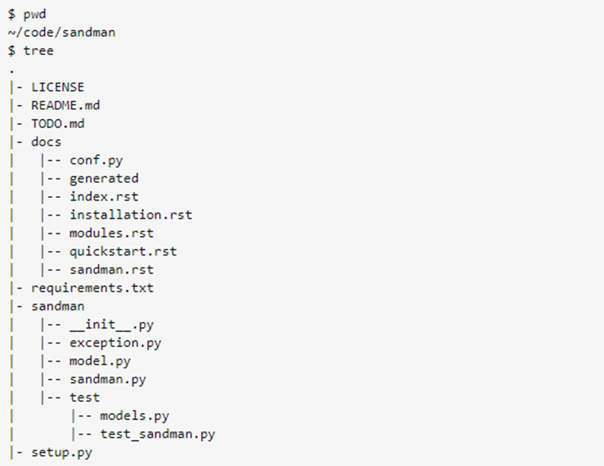
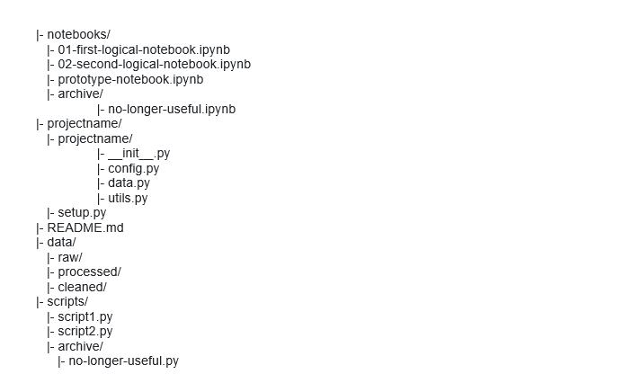

# Quelle est la structure optimale d'un projet Python (développement vs. manipulation de données) : pourquoi et comment l'utiliser ?
Il est important d’avoir une structure claire du projet Python afin de naviguer plus facilement à travers les lignes. Une bonne structure du projet permettra aussi aux successeurs de continuer à le maintenir et le modifier. Cette structure peut varier en fonction de sa taille et de sa complexité. Dans ce tutoriel, on va voir la différence de structure entre un projet de développement en Python et le projet de manipulation des données.

## Projet en développement
Dans un projet de développement en Python, la structure peut varier d’une équipe de développement à l’autre. Mais on retrouve quelques points qui reviennent le plus souvent et qui seront énumérés plus loin.

Exemple pour un projet qui s’appelle « Sandman »

Source : https://stackoverflow.com/questions/193161/what-is-the-best-project-structure-for-a-python-application

Dans l’exemple de projet Sandman, on retrouve 7 dossiers / fichiers. 

Le premier dossier se nomme LICENSE et regroupe les détails sur les conditions d’utilisation et de la distribution du code. 

Le fichier README.md est un fichier texte qui contient la documentation générale sur le projet et les utilisateurs doivent consulter cette documentation en premier lieu. On peut y retrouver les informations générales sur le projet et les réponses aux questions qui pourraient être posées par l’équipe de développement comme les directives d’installation du projet, de son utilisation et comme vous joindre.

Ensuite, le dossier TODO.md regroupe les informations sur les tâches à réaliser ainsi que les informations sur la méthodologie de développement. Pour chaque tâche, on pourrait retrouver son objectif, les exigences à la réalisation ainsi que son importance dans le projet. 

Le prochain dossier s’appelle docs et on peut y retrouver toute la documentation nécessaire à la réalisation du projet. Dedans, on va trouver la documentation générée à partir du code source, plus précisément la documentation du code (commentaires sur son fonctionnement, méthodes, etc.), les guides d’utilisation dans lesquels on peut retrouver les tutoriels ayant des exemples de codes, etc.

Dans le prochain fichier texte requirements.txt, on va retrouver les spécifications sur les dépendances du projet. Les dépendances du projet sont des packages ou des distributions qui font référence à tous les composants du logiciel demandés par le produit pour que celui-ci fonctionne.

Dans le prochain dossier sandman (dans cet exemple, mais d’habitude, il est nommé selon le nom du projet), on va retrouver le code du projet.

Le fichier setup.py est un fichier le plus important du projet. On peut retrouver deux choses dedans. Premièrement, les données sur le programme comme le nom du package, l’auteur, la version, les licences, les data files, etc. et deuxièmement, il pourrait servir d’interface garce auxquelles les commandes du package seront exécutées.

## Projet de manipulation des données
Dans cette section, serait présentée la structure réalise de projets de manipulation des données. Il est important de mentionner que cette structure est un exemple et que celle-ci peut être différente d’un projet à l’autre. Mais les points principaux vont revenir dans chaque projet.

Source: https://gist.github.com/ericmjl/27e50331f24db3e8f957d1fe7bbbe510

Le premier dossier qu’on va retrouver dans cette structure est notebooks. Dedans seront regroupés les fichiers de type Jupyter Notebook (.ipynb) qui servent à laisser les notes de projet, les prototypes de codes, etc. Un dossier qui est intéressant, ces archives/et qui contient les fichiers des notes archivées.

Le deuxième dossier est le dossier sous le nom de projectname/ (à remplacer par le nom du projet) qui est le dossier principal du projet. Dedans, on va retrouver un fichier __init__.py qui permet de lancer le programme en appelant les différentes fonctions. Ces fonctions se trouvent dans les fichiers du dossier de projectname/. Le fichier config.py va regrouper les constantes ainsi que les chemins (paths) qui sont utilisés dans d’autres fichiers de projets. Ils permettent de les importer plus facilement, plus rapidement avec un codage plus propre. Dans le fichier data.py, on va retrouver les données à traiter par le programme ainsi que les données traitées. Le fichier utils.py regroupe les fonctions utilitaires réutilisables qui seront utilisées dans les autres fichiers du projet dont les tests unitaires, les fonctions partagées, etc. Ce regroupement permettrait de simplifier le développement et améliorer la cohérence du code. Le fichier setup.py va contenir les détails de l’installation du projet. Par exemple la définition des métadonnées du projet et des fichiers à inclure dans la distribution, les spécifications des dépendances, etc.

Le fichier README.md fournit les informations sur le projet de manipulation des données pour faciliter son utilisation. Le dossier data regroupe les fichiers avec les données qui seront traitées par le projet de manipulation des données. La première sorte de fichier est raw/ dans lequel on va retrouver les données brutes non traitées. La deuxième sorte de fichier est processed/qui contient les données traitées et transformées provenant du dossier raw/. La troisième sorte de fichier clean/va contenir les données provenant du dossier processed/nettoyé en profondeur.

Le dossier script/ va regrouper les dossiers des scripts autonomes. Ceux-ci vont effectuer les tâches liées aux projets de manipulation des données. Le dossier va contenir un autre dossier avec les scripts archivés. Il est important d’archiver les dossiers et les fichiers qui ne sont pas utilisés fréquemment dans le développement du code afin de garder celui-ci organisé et facile à gérer. Il faut s’assurer de ne pas les supprimer, car il serait possible de les retracer dans le futur si une nécessité arrive. Le plus souvent, ce sont les scripts non actives ou obsolètes qui sont archivés à la suite d’un remplacement par une version améliorée ou bien leur fonctionnalité n’est plus utilisée. Cette action permet d’éviter la confusion dans le cas si les deux scripts sont présents dans le code, favorise la structure du projet propre et organisé, facilite la navigation dans les fichiers et minimise la maintenance. 

Pour conclure, il est très important d’avoir une bonne structure du projet en Python que ce soir pour un projet de développement ou un projet de manipulation des données. Une structure uniforme va permettre aux développeurs de mieux naviguer entre les dossiers et économiser le temps de maintenance du projet informatique.
