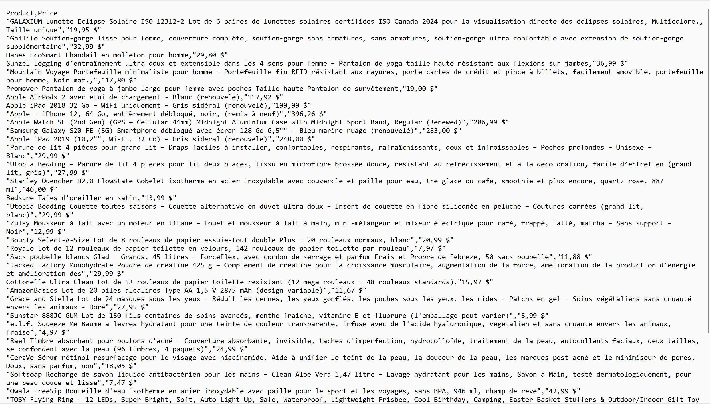

# Tutoriel : Qu'est-ce que le Web scraping : pourquoi et comment l'utiliser ?
Vous avez déjà voulu comparer les prix de plusieurs sites en une seule fois ? C'est ce que nous
allons explorer dans ce tutoriel sur le web scrapping !

## Table des matières
1. Introduction
2. Contexte
   1. Comment utiliser le Web Scrapping ?
   2. Que peut-on extraire sur le web ?
   3. Est-ce que le web scrapping est-légal ?
3. Démonstration
   1. Identifier les données à extraire
   2. Choisir les outils et les technologies
   3. Respecter les règles et les lois
   4. Extraire, transformer et charger (ETL)
   5. Analyse et visualisation
4. Conclusion
5. Références

## 1. Introduction
Dans l'ère numérique actuelle, les données sont souvent comparées à une ressource cruciale, jouant
un rôle essentiel dans l'orientation des prises de décision et l'élaboration de stratégies dans
quasiment tous les domaines d'activités. Contrairement à d'autres ressources naturelles, les données
ne sont pas extraites du sol, mais plutôt du vaste espace du web.

C'est là que prend place le web scrapping, une pratique puissante et polyvalente dédiée à la collecte
automatisée de données. Le web scrapping, également connu sous le nom d'extraction de données web,
représente le processus automatisé permettant de recueillir des informations depuis Internet.

C'est une alternative au copier-coller.

Cette technique s'avère essentiel et indispensable pour de nombreux professionnels, entreprises et
chercheurs qui aspirent à accéder à des données structurées provenant de sources web non structurées
ou semi-structurées.

## 2. Contexte
Pourquoi utiliser le Web Scraping ?

En tant qu'alternative au copier-coller, le web scraping présente l'avantage d'automatiser
l'extraction structurée de contenu. L'utilisation du web scraping permet d'économiser du temps, de
générer une base de données claire et facilement exploitable, tout en réduisant le risque d'erreurs
humaines. Lorsqu'il s'agit d'extraire un grand volume de données régulièrement mises à jour, le web
scraping se révèle particulièrement utile pour accéder à des informations à jour en temps réel et
analyser leur évolution.

Plus précisément, voici quelques raisons d'utiliser le web scrapping :

1. **Accès à des données volumineuses et variées :** Internet regorge d'informations en constante 
expansion. Le web scraping permet aux utilisateurs de puiser dans cette immense réserve d'informations
pour extraire des données précises et pertinentes, souvent indispensables à la recherche, à l'analyse
de marché, à la veille concurrentielle, et bien plus encore.

2. **Automatisation de la collecte de données :** Réaliser la collecte de données manuellement peut être
extrêmement chronophage, surtout à grande échelle. Le web scraping automatisé sauve un temps
considérable, permettant de collecter des volumes importants de données avec peu d'effort.

3. **Mise à jour des données en temps réel :** Les marchés et les environnements d'affaires évoluent
rapidement, rendant les données obsolètes tout aussi vite. Le web scraping permet une mise à jour
régulière et automatisée des données, offrant ainsi aux entreprises des informations toujours actuelles.

4. **Accessibilité et coût-efficacité :** Comparativement à d'autres méthodes de collecte de données,
le web scraping est relativement facile à mettre en œuvre et ne nécessite pas un investissement
important en ressources ou en équipements spécialisés.

### i. Comment utiliser le Web Scraping ?
1. **Identifier les données à extraire :** Avant de commencer, il est crucial de définir clairement les
informations que l'on souhaite extraire. Cela peut inclure des données de produit, des prix, des
informations de contact, des publications sur les réseaux sociaux, etc.

2. **Choisir les outils et les technologies :** Il existe une multitude d'outils et de bibliothèques
disponibles pour le web scraping, notamment en Python avec des bibliothèques comme Beautiful Soup,
Scrapy, et Selenium. Le choix de l'outil dépendra des besoins spécifiques du projet, tels que la
complexité du site web et la quantité de données à extraire.

3. **Respecter les règles et les lois :** Le web scraping doit être réalisé en conformité avec les
directives des sites web ciblés (fichiers robots.txt) et les législations en vigueur concernant la
protection des données et la confidentialité.

4. **Extraire, transformer et charger (ETL) :** Après avoir identifié les données à collecter et
choisi les outils, le processus de web scraping peut être divisé en trois grandes étapes : extraction
des données du web, transformation de ces données en un format structuré et chargement des données
dans une base de données ou un système d'analyse pour une utilisation ultérieure.

5. **Analyse et visualisation :** Une fois les données extraites et structurées, elles peuvent être
analysées et visualisées pour générer des insights. Cela peut impliquer l'utilisation de techniques de
data science, de statistiques et d'outils de visualisation de données.

Le web scraping, lorsqu'il est utilisé de manière éthique et responsable, ouvre la porte à une
multitude d'opportunités dans le domaine de la science des données, offrant un accès sans précédent
à des informations précieuses pour l'analyse d'affaires, la recherche académique, et au-delà.

### ii. Que peut-on extraire sur le web ?
Il est possible d'extraire toutes sortes de données d'Internet !

- Moteur de recherche
- Flux RSS
- Informations gouvernementales
- Journaux
- Médias sociaux
- Sites de prix
- Etc.

Cependant, cela ne signifie pas que **toutes** les données sont **toujours** disponibles.

En effet, selon le site Internet, divers outils et astuces peuvent être nécessaires pour obtenir
exactement ce dont l'on a besoin.

Par exemple, de nombreux extracteurs de sites Internet ne peuvent pas extraire de données
significatives d'un contenu visuel.

### iii. Est-ce que le web scrapping est-légal ?

Le web scraping n'est intrinsèquement pas illégal. Si un site publie des données accessibles au
public, le scraping de ces informations est généralement légal. Par exemple, récupérer les prix
des produits sur Amazon est autorisé. Cependant, le web scraping devient illégal lorsqu'il concerne
des données non destinées au public, comme des informations personnelles ou de la propriété
intellectuelle. Ce type de scraping malveillant peut entraîner des sanctions. Il existe également
des pratiques telles que le "over-scraping", où une trop grande quantité de requêtes est envoyée sur
une courte période, pouvant entraîner des problèmes pour les hébergeurs.

## Démonstration
### i. Identifier les données à extraire
[Amazon.ca](https://www.amazon.ca/-/fr/ref=nav_logo) est la version canadienne du géant du
commerce électronique Amazon. Il propose une vaste gamme de produits, allant des articles électronique
aux produits ménagers, en passant par les vêtements et les livres. Les clients peuvent acheter des
produits neufs ou d'occasion.

Dans le cadre de cet exemple, je vais "scrapper" [la page des meilleures ventes d'Amazon.ca](https://www.amazon.ca/-/fr/Best-Sellers-generic/zgbs/?ref_=nav_cs_bestsellers)
afin d'obtenir les produits et leur prix.

Pour extraire les données, il faut inspecter la page web pour chercher l'emplacement de celles-ci :

- Nom du produit : ```<div class="p13n-sc-truncate-desktop-type2  p13n-sc-truncated">```
- Prix du produit : ```<span class="_cDEzb_p13n-sc-price_3mJ9Z">```

### ii. Choisir les outils et les technologies 
Pour ce type d'extraction, nous pouvons aller avec un outil comme Beautiful Soup et nous allons extraire
les données vers un fichier csv.


### iii. Respecter les règles et les lois
Avant de scraper un site web, il faut  de respecter les règles définies dans le fichier robots.txt du site. Pour Amazon, vous le trouverez généralement à l'URL suivante : https://www.amazon.ca/robots.txt.


### iii. Extraire, transformer et charger (ETL)
L'ensemble du code, avec les différentes étapes commentées, est disponible dans le fichier DEMO, mais voici les grandes lignes des étapes d'extraction, de transformation et de chargement.

Extraction
```
# Définir la variable url qui va contenir l'url de la page à scrapper
url = "https://www.amazon.ca/-/fr/Best-Sellers-generic/zgbs/?ref_=nav_cs_bestsellers"

# Charger le code de la page avec BeautifulSoup
soup = Bs(page, 'html.parser')
```

Transformation
```
# Extraction des noms de produits à partir des balises div avec la classe spécifiée
products_divs = soup.find_all('div', {'class': 'p13n-sc-truncate-desktop-type2'})
price_divs = soup.find_all('span', {'class': '_cDEzb_p13n-sc-price_3mJ9Z'})

# Initialisation de la liste pour stocker les noms de produits
products = []
prices = []

# Boucle pour traiter chaque balise div contenant un nom de produit
for div in products_divs:
    # Extraire le texte du produit et nettoyer les espaces
    product_name = div.text.strip()
    # Ajouter le nom du produit à la liste
    products.append(product_name)

# Boucle pour traiter chaque balise div contenant un prix de produit
for div in price_divs:
    # Extraire le texte du prix et nettoyer les espaces
    price_name = div.text.strip()
    # Ajouter le prix à la liste
    prices.append(price_name)
```

Chargement
```
# Écrire les données dans un fichier CSV
with open('amazon_products.csv', 'w', newline='', encoding='utf-8') as csvfile:
    fieldnames = ['Product', 'Price']
    writer = csv.DictWriter(csvfile, fieldnames=fieldnames)

    writer.writeheader()
    for product, price in zip(products, prices):
        writer.writerow({'Product': product, 'Price': price})

print("Les données ont été stockées dans amazon_products.csv avec succès.")
```
Une section du code n'a pas été présentée ici puisqu'elle n'entre pas directement dans le ETL. En effet
j'ai ajouté la section suivante : 
```
# Ajout d'en-têtes pour simuler une requête venant d'un navigateur web afin d'éviter d'être bloqué
headers = {
    'User-Agent': 'Mozilla/5.0 (Windows NT 10.0; Win64; x64) AppleWebKit/537.36 (KHTML, like Gecko) Chrome/58.0.3029.110 Safari/537.3'}

req = urllib.request.Request(url, headers=headers)

# Tentative de récupération de la page sans surcharger le serveur
max_attempts = 5
for attempt in range(max_attempts):
    try:
        page = urllib.request.urlopen(req).read()
        break  # Si la requête réussit, sortir de la boucle
    except urllib.error.HTTPError as e:
        if e.code == 429:
            print(f"Erreur HTTP 429: Trop de requêtes. Tentative {attempt+1}/{max_attempts}.")
            time.sleep(10)  # Attendre 10 secondes avant de réessayer
        else:
            raise  # Renvoyer l'exception si ce n'est pas une erreur 429
```
Le but de celle-ci est de simuler une requête provenant d'un navigateur web afin d'éviter d'être bloqué, pour avoir envoyé trop de requête trop rapidement, par le serveur distant.

### iv. Analyse et visualisation
Cela nous a donc créé un fichier csv. (amazon_products) à deux colonnes (produits et prix) qui peut être ouvert en excel pour effectuer plus d'analyse. Par exemple, nous pourrions comparer les données avec d'autres sites et etc.


## Conclusion
Dans ce tutoriel, nous avons exploré le potentiel immense du web scraping pour extraire automatiquement des données du web, offrant une ressource précieuse pour la recherche, l'analyse de marché et la veille concurrentielle. En démontrant comment extraire les données des meilleures ventes d'Amazon.ca, nous avons vu l'efficacité du web scraping pour collecter des informations utiles rapidement et efficacement.

Toutefois, il est crucial de naviguer dans le paysage du web scraping avec une compréhension claire des lois et des règles éthiques, assurant que notre usage reste dans le cadre légal et respectueux de la vie privée.

En conclusion, le web scraping s'avère être un outil inestimable pour l'analyse de données, ouvrant des avenues pour des insights approfondis et des décisions basées sur des données actualisées. Utilisé judicieusement, il peut significativement enrichir nos analyses et notre compréhension des dynamiques du web.
## Références
HubSpot Blog." HubSpot, https://blog.hubspot.fr/website/web-scrapping#:~:text=D%C3%A9terminer%20l%27objectif%20de%20l%27extraction%20de%20contenu.%20Utiliser%20un,y%20collecter%20le%20contenu%20et%20structurer%20les%20donn%C3%A9es. 

Web Scraping : Tout Savoir." DataScientest, https://datascientest.com/web-scraping-tout-savoir. 

Qu’est-ce Que le Web Scraping ?" Kinsta, https://kinsta.com/fr/base-de-connaissances/web-scraping/.

Tutoriel Python : Comment Scrapper un Site en Python." Cours-Gratuit, https://www.cours-gratuit.com/tutoriel-python/tutoriel-python-comment-scrapper-un-site-en-python?expand_article=1#_Toc60090618.
