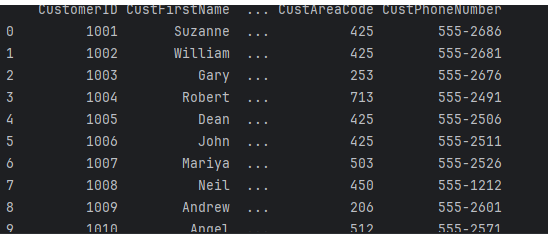

# Tutoriel: qu'est ce que c'est que une base de données pourquoi et comment l'utiliser ?

:warning: **Ce tutoriel est en cours de développement.** :warning:

## Introduction 

Tout d’abord la base de données est une collection organisée d’informations structurées, généralement stockées électroniquement dans un système informatique. Une base de données est généralement contrôlée par un système de gestion de base de données (DBMS). L’ensemble que constituent les données et le DBMS, ainsi que les applications qui leur sont associées, est nommé système de base de données, ou simplement base de données. Dans les opérations aujourd’hui, les données que contiennent les bases de données les plus courantes sont généralement modelés en lignes et en colonnes, dans une série de tables, pour assurer l’efficacité du traitement et de l’interrogation des données. Les données peuvent être facilement consultées, gérées, modifiées, mises à jour, contrôlées et organisées. La plupart des bases de données utilisent le langage SQL pour l’écriture et l’interrogation des données. La connexion a une base de données est le processus par lequel un programme informatique, souvent une application ou un site web, établit une liaison avec une base de données pour récupérer, stocker ou manipuler des données. Cette connexion permet au programme d'envoyer des requêtes à la base de données pour obtenir des informations, les modifier ou ajouter de nouvelles données. 

Pour établir cette connexion, le programme doit généralement fournir des informations telles que le nom de l'hôte où se trouve la base de données, le nom de la base de données elle-même, ainsi que des informations d'identification telles que le nom d'utilisateur et le mot de passe permettant l'accès à la base de données.

Une fois la connexion établie, le programme peut interagir avec la base de données en utilisant un langage de requête spécifique tel que le SQL (Structured Query Language) pour effectuer des opérations telles que la récupération, l'insertion, la mise à jour ou la suppression de données. La connexion à une base de données est une étape essentielle dans le développement de nombreuses applications informatiques qui stockent et gèrent des données.

Utiliser une base de donnée est important en affaires et en finance, les bases de données jouent un rôle crucial dans la gestion et l'analyse des données liées aux opérations commerciales, aux transactions financières, aux clients, aux produits, et bien plus encore. 

Pour utiliser une base de données sur python cela se fait en plusieurs étapes :

## 1 étape : 
Il faut installer dans la liste de commande pip install mysql pour commencer a utiliser la base de donnée 

```python
# Installation liste de commande
pip install mysql
```

## 2 étape : 
Ensuite une fois installer il faut importer les données dans python en codant 

```python
# Section d'importation de module
import pandas as pd
```


Explication : L'expression "import pandas as pd" est une instruction en Python qui permet d'importer la bibliothèque pandas et de l'attribuer à l'alias "pd". En Python, les bibliothèques sont des ensembles de fonctions et d'outils prédéfinis qui permettent d'effectuer des tâches spécifiques. Pandas est une bibliothèque très populaire utilisée pour la manipulation et l'analyse de données. En utilisant "import pandas as pd", on importe toutes les fonctionnalités de la bibliothèque pandas dans notre programme Python et on lui attribue l'alias "pd". Cela signifie que nous pouvons utiliser "pd" pour accéder aux fonctionnalités de pandas dans notre code.


##  3 étape : 
Télécharger la base de donnée sur l’ordinateur puis  insérer la base de donnée en python avec un code.

Pour se faire nous devons aller sur SQL. Ensuite on convertir la base de données SQL en fichier CSV. On peut utiliser des outils de gestion de base de données ou des scripts SQL pour extraire les données de la base de données SQL et les exporter dans un fichier CSV. La méthode exacte dépendra du SGBD qu’on utilise. Par exemple, pour MySQL, on peut  utiliser l'utilitaire mysqldump ou exécuter une requête SQL pour exporter les résultats dans un fichier CSV.  Voici ce que ca donne avec la base de donnée customers 

```python
# Insérer la base de données sur python
data = pd.read_csv("C:\\Users\\emman\\OneDrive\\Bureau\\donnees_customers.csv")
```

La base de données se trouve en dessous.




 

 


 


## 4 étape :
Vu que la base de donnée a été intégré sur python on peut commencer des manipulations. Nous pouvons faire des tri ou encore des suppressions. 
Exemple : Pour utiliser uniquement le nom de famille voici comment nous devrons procéder : 

```python
# Section d'importation des modules
print(data.shape)
print(data["CustFirstName"])
```

Dans ce code, data.shape renvoie un tuple contenant le nombre de lignes et de colonnes du DataFrame ensuite data["CustFirstName"] renvoie la colonne "CustFirstName" du DataFrame. Et pour finir les instructions print() sont utilisées pour afficher ces valeurs à la sortie standard.

## Modifier un seul nom :

Pour modifier un seul nom dans la colonne "CustFirstName" de votre DataFrame, on peut utiliser l'indexation booléenne pour sélectionner les lignes correspondantes, puis attribuer une nouvelle valeur au nom que nous souhaitons modifier. Voici comment on peut le faire :

 

 ```python
# Supposons que vous souhaitez modifier le nom "Jim" en "Jima"
index_client = 25
```


```python
#  Utilisez l'indexation booléenne pour sélectionner les lignes où le nom est "John"
indices_a_modifier = data['CustFirstName'] == "Jim"
```

 
```python
# Attribuez une nouvelle valeur au nom pour les lignes sélectionnées
data.loc[indices_a_modifier, 'CustFirstName'] = "Jima"
```

Dans cet exemple, nous avons utilisé l'indexation booléenne pour sélectionner les lignes où la valeur de la colonne "CustFirstName" est "Jim". Ensuite, nous avons utilisé .loc[] pour accéder à ces lignes et modifier la valeur de la colonne "CustFirstName" pour ces lignes, en remplaçant "Jim" par "Jima". Enfin, nous avons imprimé le DataFrame pour vérifier les modifications.

## Modifier le numéro de telephone : 

Pour modifier un numéro de téléphone dans une colonne spécifique de notre DataFrame, on peut suivre une approche similaire à celle utilisée pour modifier un nom. Voici comment on peut procéder : 


```python
# Supposons que vous souhaitiez modifier le numéro de téléphone pour le client avec l'index 0
index_client = 25
```

 
```python
# Nouveau numéro de téléphone
nouveau_numero = "210 555-2312"
```


```python
# Modifier le numéro de téléphone pour le client spécifique
data.loc[index_client, '210 555-2312'] = nouveau_numero
```

## Supprimer un nom : 

Pour supprimer toutes les lignes où le nom est égal à une certaine valeur, on peut utiliser l'indexation booléenne et la méthode .drop() de pandas.

Voici comment vous pouvez supprimer toutes les lignes où le nom est "Estella", par exemple :


```python
# Supprimer toutes les lignes où le nom est "Estella"
data = data.drop(data[data['CustFirstName'] == 'Estella'].index)
```

Afficher le DataFrame après la suppression
```python
# Afficher le DataFrame après la suppression
print(data)
```

data[data['CustFirstName'] == 'Estella'] crée une série booléenne indiquant les lignes où la valeur de la colonne "CustFirstName" est égale à "Estella".

.index récupère les indices de ces lignes.

data.drop(...) supprime ces lignes du DataFrame.

Cela supprimera toutes les lignes où le nom est "John" de votre DataFrame. Assurez-vous que cela correspond à ce que vous voulez accomplir avant d'exécuter le code, car cela modifie directement votre DataFrame.


## Transfert de données 

Les bases de données offrent une solution efficace pour organiser les données, simplifiant ainsi leur gestion par rapport aux méthodes traditionnelles telles que les fichiers plats ou les structures complexes. Elles facilitent les opérations cruciales d'insertion, de mise à jour et de suppression, garantissant ainsi la qualité et l'actualité des données. Évolutives, elles intègrent des fonctionnalités avancées de sécurité telles que le contrôle d'accès et la validation des entrées, tout en assurant une gestion robuste de la concurrence pour maintenir la cohérence des données. De plus, elles réduisent la redondance des informations, préservant ainsi l'intégrité des données essentielles à l'entreprise.


## Limite et prochaine étape 

La configuration initiale des bases de données peut représenter un défi pour les novices, nécessitant une solide compréhension des concepts avancés tels que les modèles de données et les clés primaires/étrangères. La gestion efficace de la maintenance et de la performance devient de plus en plus complexe à mesure que le volume de données augmente. Bien que les bases de données offrent des fonctionnalités de sécurité avancées, leur mise en œuvre requiert une expertise approfondie pour éviter les vulnérabilités potentielles. Pour progresser, il est impératif de maîtriser pleinement le langage SQL et d'explorer d'autres systèmes de gestion de bases de données disponibles sur le marché. En parallèle, une connaissance approfondie des meilleures pratiques en matière de conception et d'optimisation de la performance s'avère essentielle pour garantir des opérations efficaces. Il est également crucial de renforcer les mesures de sécurité des bases de données afin de prévenir les menaces potentielles et de protéger les données sensibles contre toute intrusion.

## Conclusion

En somme, ce tutoriel exhaustif sur la manipulation des données en Python a abordé une panoplie d'aspects cruciaux pour me guider vers une maîtrise avancée de ce pilier essentiel du traitement de données. J'ai exploré en détail les fonctionnalités clés des bibliothèques Pandas , tout en mettant en lumière des méthodes pratiques pour importer, nettoyer, filtrer et analyser des ensembles de données de manière efficace.

Il est primordial de souligner que la compétence en manipulation des données revêt une importance significative dans de multiples domaines, incluant l'analyse de données, l'apprentissage automatique, la science des données et la visualisation. En consolidant ma compréhension de ces concepts et en m'exerçant régulièrement, je vais développer la capacité de traiter avec aisance des données de toutes tailles et de mener à bien des projets complexes avec assurance.
