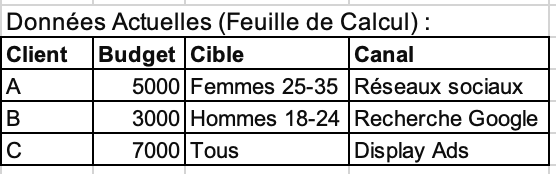
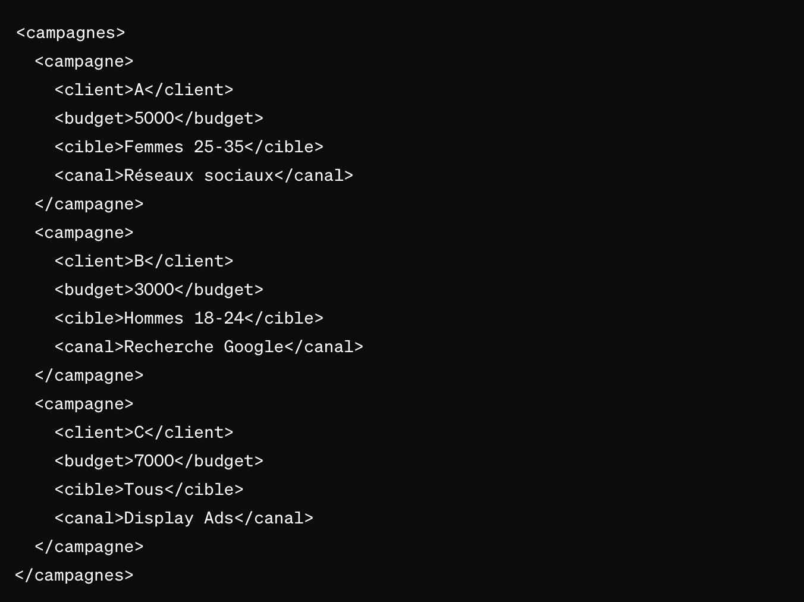

## Exemple dans un contexte marketing🗞

Envisagez-vous travailler au sein d'une agence de marketing numérique, où votre rôle implique la gestion des campagnes publicitaires pour divers clients. Chaque client présente des exigences spécifiques en matière de public cible, de budget et de canaux de diffusion. Actuellement, la gestion de ces campagnes se fait de manière manuelle, avec des fichiers de configuration dispersés et des approches diverses pour représenter les données. Les équipes marketing font face à des défis pour maintenir la cohérence des paramètres de campagne et pour effectuer des ajustements rapides en cas de besoin.

**Imaginons que vous ayez trois clients, chacun avec une campagne publicitaire distincte. Actuellement, les informations sont présentées de manière non standardisée dans des feuilles de calcul. En utilisant XML, il serait possible de créer une structure commune pour représenter ces données, simplifiant ainsi la gestion centralisée.**

Données actuelles :

L'utilisation de XML :

De cette manière :

- L'organisation uniforme des données simplifie leur compréhension et leur gestion.
- Les ajustements peuvent être réalisés en modifiant simplement les balises, ce qui facilite la réactivité aux changements.
- Les données peuvent être aisément partagées entre différentes plateformes et outils de gestion.
