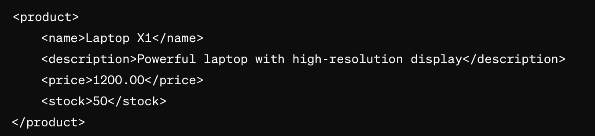

## Exemple dans un contexte réel

Cette exemple a pour but de vous demontrer que vous pourriez être confronté au language XML lors d'un emploi étudiant ou d'un stage. 
*Pour cette démonstration, j'ai utilisé une entreprise d'informatique mais cela aurait pu etre toute autre type d'entreprise.*

Supposons que vous fassiez partie d'une entreprise de commerce électronique en expansion, se spécialisant dans la vente de divers produits. Cette société gère un inventaire complexe à l'aide d'une base de données qui englobe des informations telles que les noms des produits, les descriptions, les prix et les niveaux de stock.

**Actuellement, l'entreprise fait face au défi de partager ses informations d'inventaire avec divers partenaires, dont des applications tierces et des services en ligne. Les difficultés comprennent la diversité des systèmes utilisés par ces partenaires et la nécessité de garantir une intégration harmonieuse.**

Solution proposé : Utilisation de XML
Créer un fichier XML représentant les détails d'un produit spécifique, tel qu'un ordinateur portable, dans l'inventaire de l'entreprise.

De cette manière :
- Chaque produit est enveloppé dans la balise product.
- Les divers détails du produit, tels que le nom, la description, le prix et le stock, sont représentés par des balises spécifiques name, description, price, stock .
- Cette structure transparente favorise une compréhension immédiate des informations relatives au produit.

Cette illustration met en évidence comment XML peut être exploité pour structurer des données, les rendre aisément compréhensibles, et faciliter un échange normalisé d'informations entre différentes plateformes.
